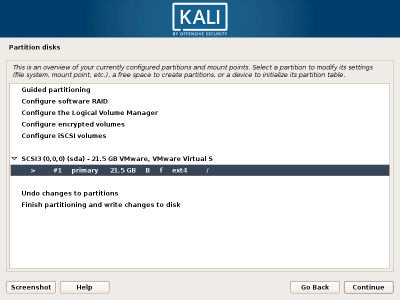
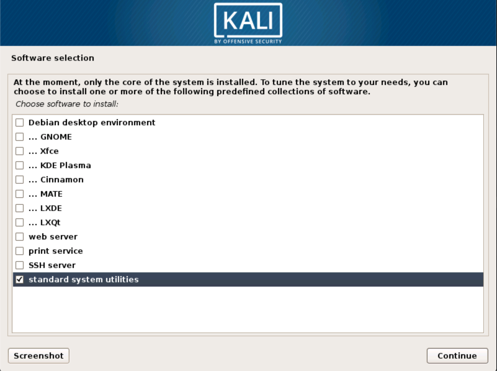
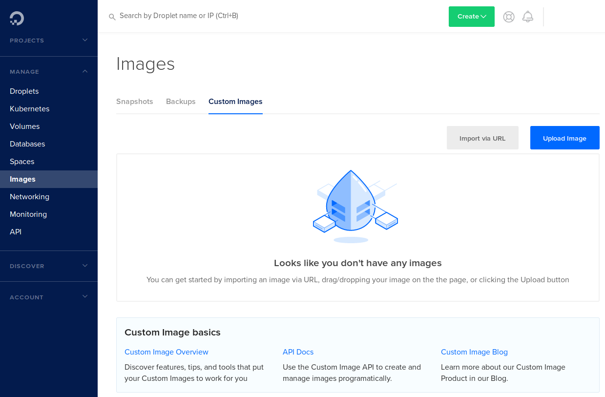
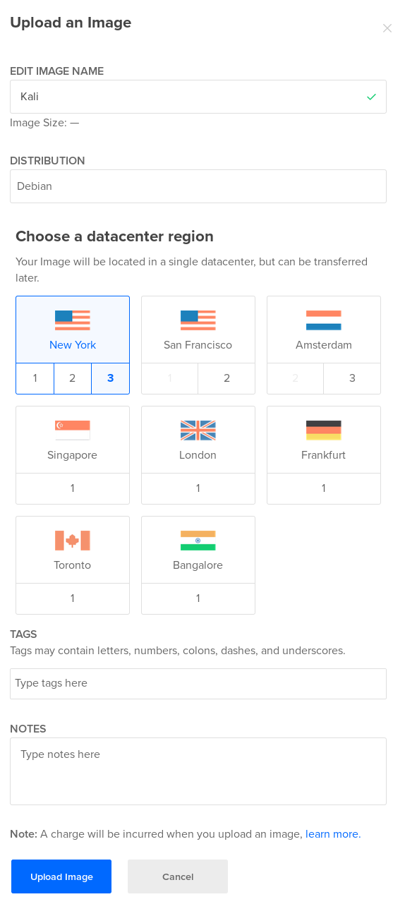
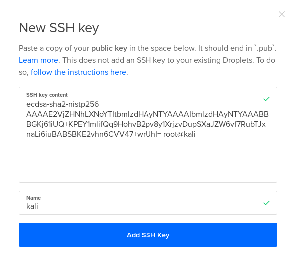
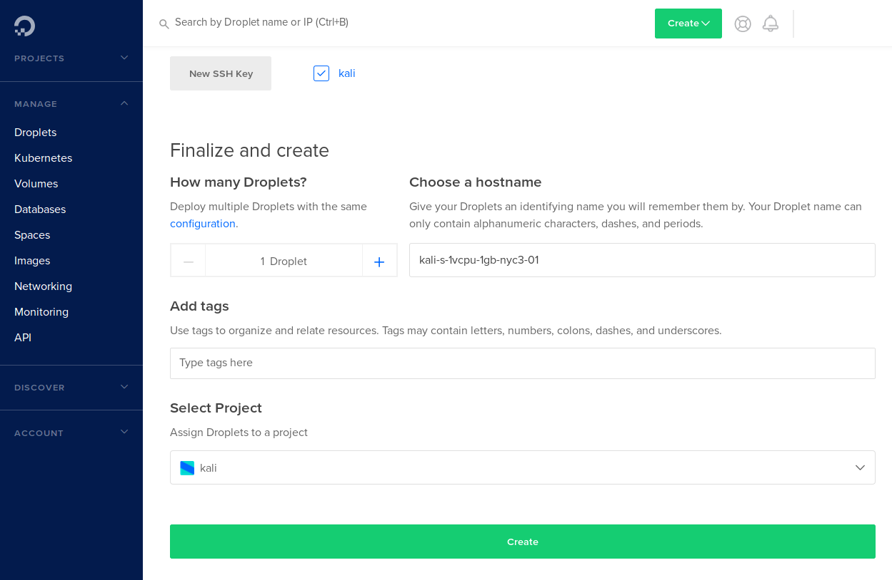

[DigitalOcean](https://www.digitalocean.com/) is a cloud provider similar to AWS, Microsoft Azure, Google Cloud Platform, and many others. They offer instances, called "droplets", with different Linux distributions such as Debian, Ubuntu, FreeBSD, etc. Similar to AWS, DigitalOcean has datacenters around the world and sometimes multiple datacenters in each country.

However, one feature in particular sets them apart them from their competitors. A little while ago, they added support for [custom images](https://blog.digitalocean.com/custom-images/), which allows users to import virtual machine disks and use them as droplets. This is perfect for us as we can use our own version of Kali Linux in their cloud.

While it might be possible to load the [official Kali Linux virtual images](https://www.offensive-security.com/kali-linux-vm-vmware-virtualbox-image-download/), it wouldn't be very efficient. Instead, we'll build a lightweight Kali installation with the bare minimum to get it working.

## Get the netboot ISO
​
By default, the Kali Linux ISOs on the download page have a desktop environment installed, and while we could use it to build a virtual machine, we want to minimize the amount of data we have to upload to DigitalOcean for reasons we will talk about later. Having a GUI running on a headless system is also a waste of resources so while we could uninstall it or disable it, we'll install the virtual machine using [a netboot ISO](http://http.kali.org/kali/dists/kali-rolling/main/installer-amd64/current/images/netboot/). If you are comfortable with a text installation, grab the mini.iso in this directory. If not, head to the [gtk/](https://http.kali.org/kali/dists/kali-rolling/main/installer-amd64/current/images/netboot/gtk/) directory and grab the mini.iso in there, which will start a graphical installer.

## Create the Virtual Machine
​
With our mini.iso , we can now begin to build our virtual machine. Create a new virtual machine setting the OS to the latest Debian 64-bit and allocating a 20 GB hard disk. If needed, detailed set-up is explained on the [Kali Training website](https://kali.training/topic/booting-kali-in-live-mode/). It is important to store the virtual disk as a single file that is dynamically allocated. The rest like the amount of CPU and RAM won't matter because only the disk file will be uploaded to DigitalOcean.
​
Disk size matters as billing is based on disk size for custom images. It will also impact the choice of instance we can create. Let's say a 40 GB hard disk is created, it will prevent creating an instance at the $5/month level because its maximum hard disk size is 25 GB. In that case we would be forced to use the $10/month option for instances with 50 GB disks. Don't worry, even though the disk is 20 GB, it will get expanded depending on the droplet plan chosen.

During the installation, select manual partitioning and set it up as shown below, with all files in one partition and no swap file.



During the installation, it will prompt for software preferences. For the sake of simplicity and to limit disk space use, we'll just have the base system installed, therefore we'll only select "standard system utilities" as shown below.



## Update the System

When installation is complete and after rebooting, we login at the console and [update the system](/docs/general-use/updating-kali/).

```console
kali@kali:~$ sudo apt update
kali@kali:~$ sudo apt full-upgrade -y
```

If you don't see it going over a mirror during `sudo apt update`, you may have accidentally forgotten to add a network mirror during the installation. Follow the [instructions on the Kali Docs site](/docs/general-use/kali-linux-sources-list-repositories/) to fix it and run both of the commands again.

### Install Required Packages

In order for DigitalOcean to configure the system for us, we need to install the ***cloud-init*** package:

```console
kali@kali:~$ sudo apt install -y cloud-init
kali@kali:~$ echo 'datasource_list: [ ConfigDrive, DigitalOcean, NoCloud, None ]' > /etc/cloud/cloud.cfg.d/99_digitalocean.cfg
kali@kali:~$ sudo systemctl enable cloud-init
```

### Prepare for SSH

Since we will need to use SSH to connect to the system on DigitalOcean, the ***openssh-server*** package needs to be installed (and enabled) as well:

```console
kali@kali:~$ sudo apt install -y openssh-server
kali@kali:~$ sudo systemctl enable ssh.service
```

When creating a standard droplet, you can choose to use SSH keys or not. However, when using custom images, this isn't an option and using SSH keys is mandatory. For this reason, DigitalOcean requires us to remove the root password:

```console
kali@kali:~$ passwd -d root
```

We also need to create a ***/root/.ssh*** folder:

```console
kali@kali:~$ mkdir -p /root/.ssh/
```

### Cleanup

Before we finish with our virtual machine, we run a few commands to clean things up:

```console
kali@kali:~$ apt autoremove
kali@kali:~$ apt autoclean
kali@kali:~$ rm -rf /var/log/*
kali@kali:~$ history -c
```

At this point, our virtual machine is ready so we run 'poweroff' to shutdown the system.

```console
kali@kali:~$ poweroff
```

## Uploading

In the virtual machine folder, locate the ***.vmdk*** file, then compress it using bzip2, gzip, or zip in preparation for uploading to DigitalOcean.

```console
$ bzip2 kali.vmdk
```

Login to your DigitalOcean account. In the "Manage" section on the left, click on "Images", then select the "Custom Images" tab.



From there, we upload the compressed disk image. We'll name it Kali, mark it as Debian, and select the region and datacenter to upload it to. Note that once uploaded to a location, droplets can only be started at that location, which is a current limitation for custom images. Another thing to remember at this stage is that uploaded images consume disk space and DigitalOcean will bill based on disk usage.



## Starting a Droplet

Once done, the "Uploaded" column will indicate how long ago it was uploaded. Now we will click on the "More" option of the image and select "Start a droplet".


You will be taken to the droplet settings where you can select the droplet plan, the SSH key, and the project to start it in. Since this is a custom image, it is required you use a SSH key. You can either select an existing one or upload a new one by clicking on "New SSH key", which will open the following screen where you can paste the public key and name it:



Once done, click "Create" as shown below. It will then take you back to the dashboard (Manage > Droplets) where all your droplets are listed. Because we are using a SSH key, DigitalOcean will not send an email with credentials for the droplet.



Within a few seconds, and after the IP is displayed, our droplet will be ready. In order to connect, we will need to use the private SSH key we created (called MY_KEY in this example):

```console
$ ssh -i MY_KEY kali@192.168.1.1
The authenticity of host '192.168.1.1 (192.168.1.1)' can't be established.
ECDSA key fingerprint is SHA256:d83fcd43d25e2a7edd291666160b47360cc85870ded.
Are you sure you want to continue connecting (yes/no)? yes
Warning: Permanently added 'IP' (ECDSA) to the list of known hosts.
Linux kali-s-1vcpu-1gb-nyc3-01 4.19.0-kali5-amd64 #1 SMP Debian 4.19.37-2kali1 (2019-05-15) x86_64
The programs included with the Kali GNU/Linux system are free software;
the exact distribution terms for each program are described in the
individual files in /usr/share/doc/*/copyright.
Kali GNU/Linux comes with ABSOLUTELY NO WARRANTY, to the extent
permitted by applicable law.
```

Now we have a nice, minimal Kali Linux installation that we can deploy and customize as needed.

```console
kali@kali-s-1vcpu-1gb-nyc3-01:~$ lsb_release -a
No LSB modules are available.
Distributor ID: Kali
Description: Kali GNU/Linux Rolling
Release: 2019.2
Codename: n/a

kali@kali-s-1vcpu-1gb-nyc3-01:~$
kali@kali-s-1vcpu-1gb-nyc3-01:~$ uname -a
Linux kali-s-1vcpu-1gb-nyc3-01 4.19.0-kali5-amd64 #1 SMP Debian 4.19.37-2kali1 (2019-05-15) x86_64 GNU/Linux

kali@kali-s-1vcpu-1gb-nyc3-01:~$
kali@kali-s-1vcpu-1gb-nyc3-01:~$ free -h
total used free shared buff/cache available
Mem: 987Mi 51Mi 527Mi 1.0Mi 407Mi 790Mi
Swap: 0B 0B 0B
kali@kali-s-1vcpu-1gb-nyc3-01:~$
```
