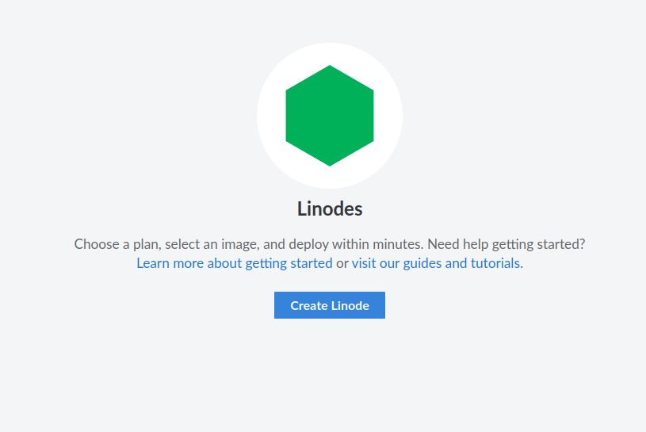
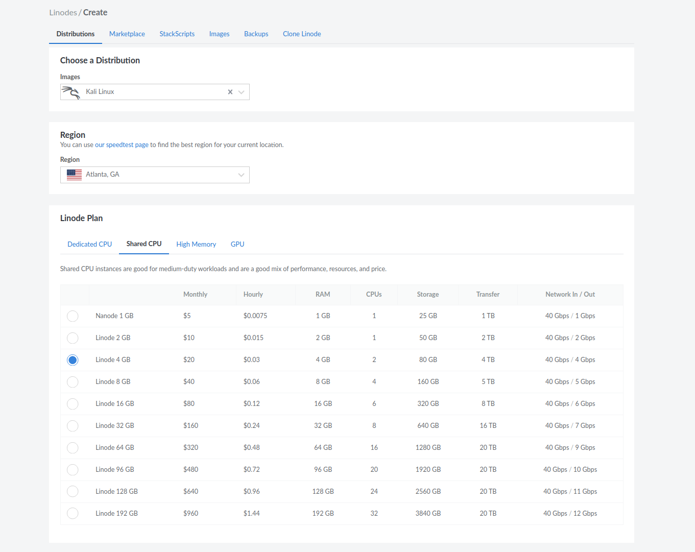
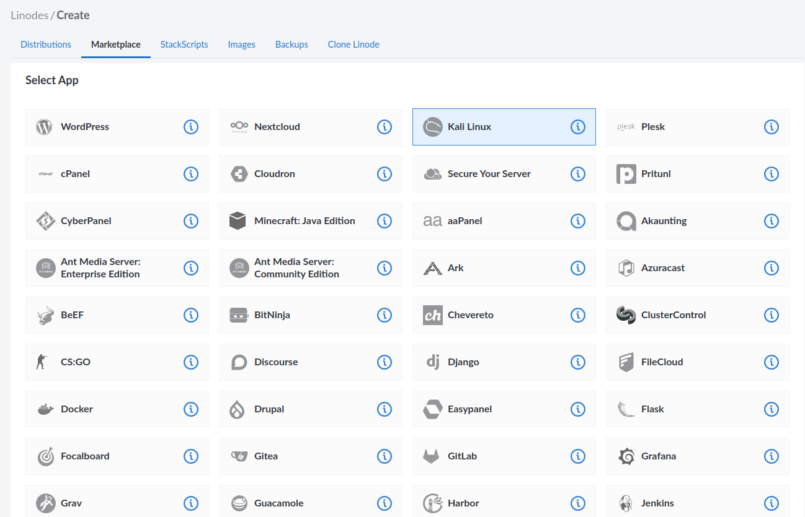
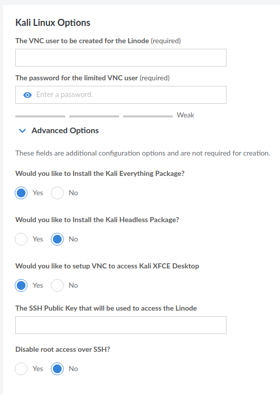
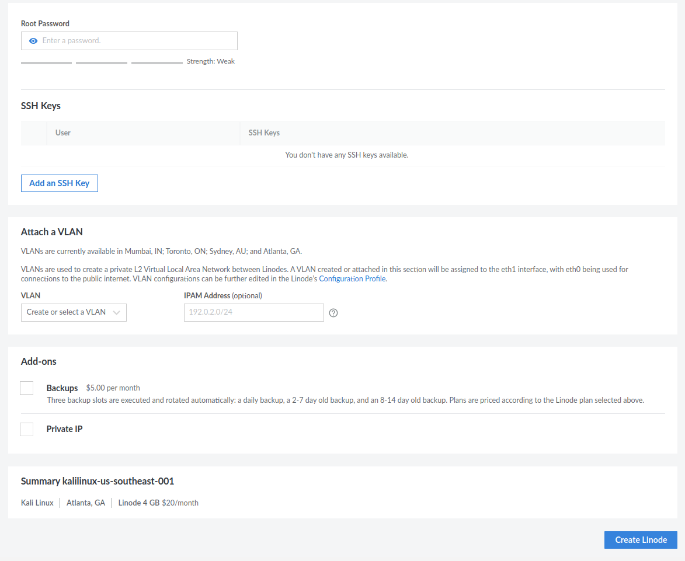

There are two options when it comes to deploying a Kali Linux Linode instance. We will quickly cover both and then explain how to go about setting up them.

- Kali as a distribution
    - [Kali as a distribution info](Kali-as-a-distribution)
    - [Kali as a distribution configuration](Kali-as-a-Distribution-configuration)
- Kali from the Marketplace
    - [Kali from the Marketplace info](Kali-from-the-Marketplace)
    - [Kali from the Marketplace configuration](Kali-from-the-Marketplace-configuration)

### Kali as a distribution

This is a bare Kali install, with only [kali-linux-core](/docs/general-use/metapackages/) installed, got by creating a Linode instance and selecting Kali as the distribution. This can be useful if there is only a couple tools that are going to be used, and allows finer control over the system. This in turn also helps reduce operating cost! If you change your mind later and want the normal set of tools, they are always installable with our [metapackages](/docs/general-use/metapackages/). Just run the following:

```console
kali@kali:~$ sudo apt update && sudo apt install kali-linux-default -y
...

kali@kali:~$
```

### Kali from the Marketplace

The alternative option is to run ["Deploy This App"](https://www.linode.com/marketplace/apps/kali-linux/kali-linux/) from the Linode marketplace. This will create a Linode instance and, depending on the options selected during configuration, will install a Kali Linux instance with certain [metapackages](/docs/general-use/metapackages/) installed. Keep in mind this may take some time before Linode's scripts run and installs everything. This option is good if you may not know ahead of time what may be needed or just want to have the familiar Kali Linux environment.

Keep in mind that both these options are free to create, with the only cost being the standard running cost of the instance. Now lets set up these systems.

For both instances we start off with the same view:



After selecting "Create Linode" we are met with the choice of either creating a bare Kali install or using the marketplace. Lets first create a bare Kali install.

### Kali as a Distribution configuration

We want to first select Kali Linux in the drop down for "Image." From there we customize based off of personal preference. Here is an example configuration:




One very important field is "Root Password." What we set here will determine the password we use during SSH. If we forget this password we will lose access to this instance and have to re-create it. Once ready we can select "Create Linode" again and then wait for provisioning to complete. Once complete we can use the SSH Access command to connect to our instance.


### Kali from the Marketplace configuration

After selecting "Create Linode" we will want to select "Marketplace" at the top of the webpage. From here, we can see Kali Linux listed as the third option.



After selecting Kali Linux we will scroll down and notice some configuration options specific to Kali.



As mentioned previously, these will determine what [metapackages](/docs/general-use/metapackages/) are installed as well as will setup VNC access automatically. These options should be configured according to our needs to prevent too many resources being taken up. From here we will have standard Linode configuration settings.




After configuring these settings we can select "Create Linode" and wait for provisioning to complete. Once complete we can use the SSH Access command to connect to our instance. Be sure to wait about an hour or so before use to allow Linode to automatically configure the system as we selected it.