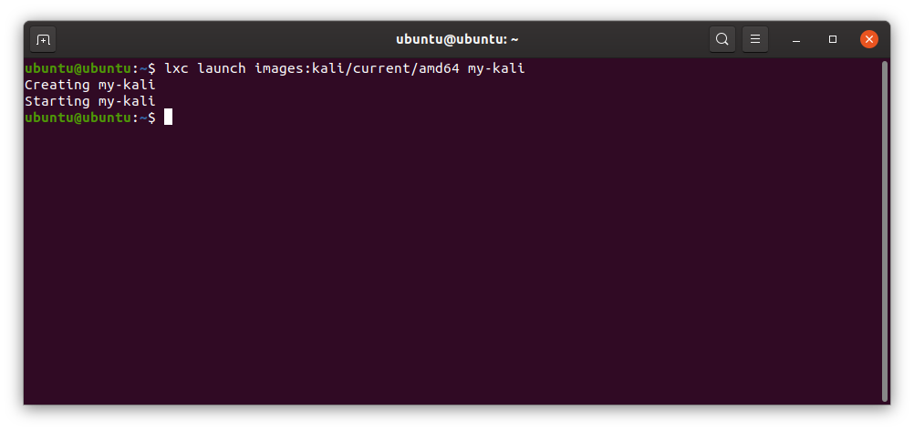
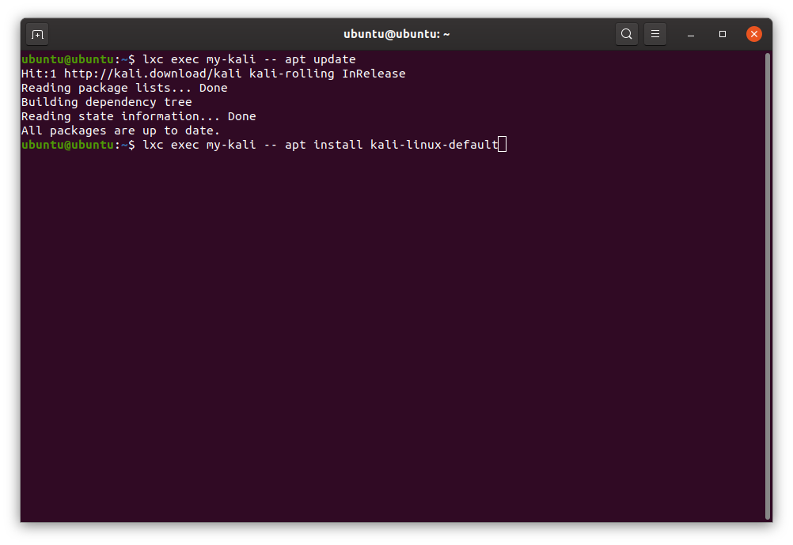
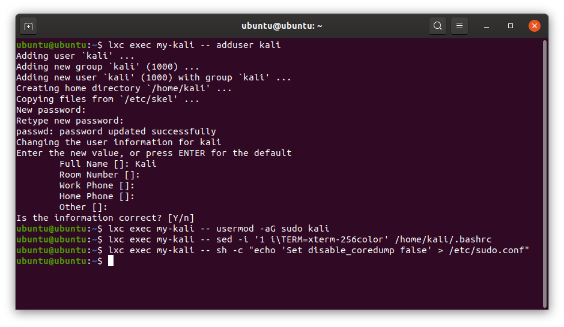
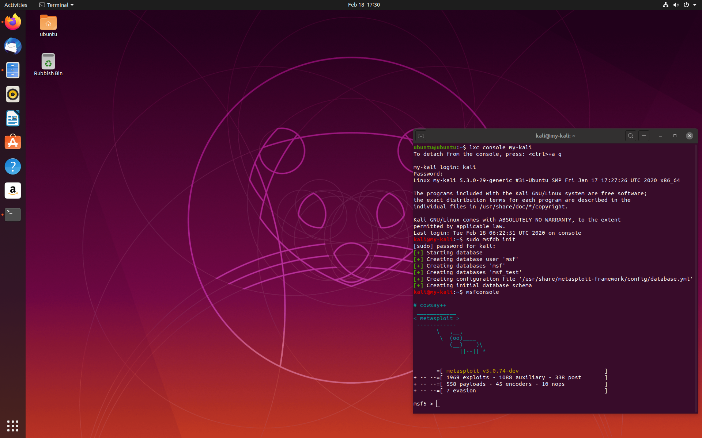
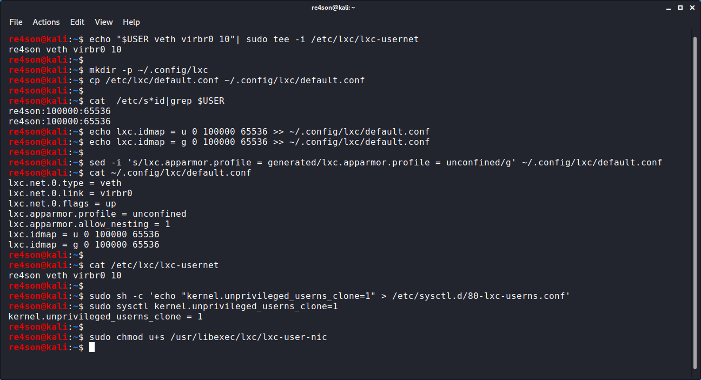
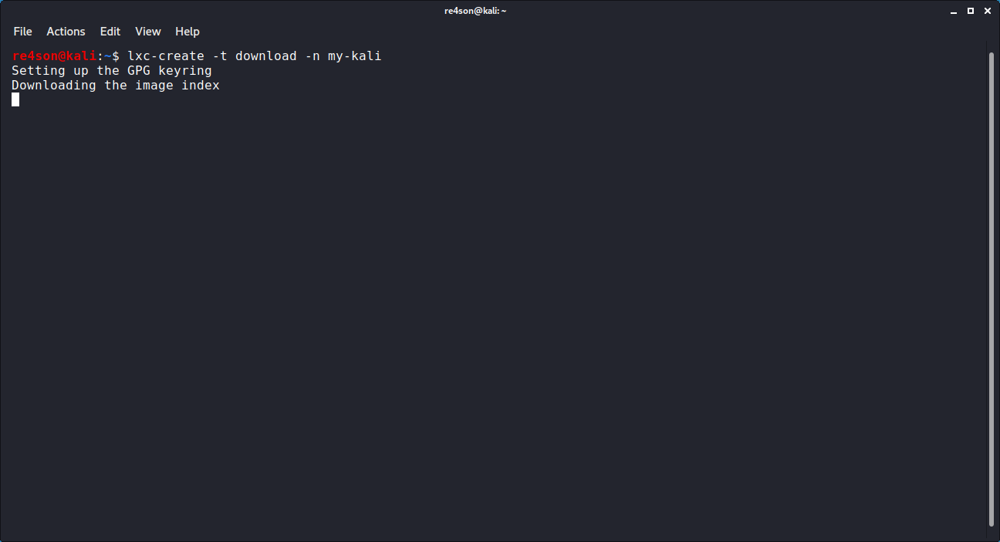
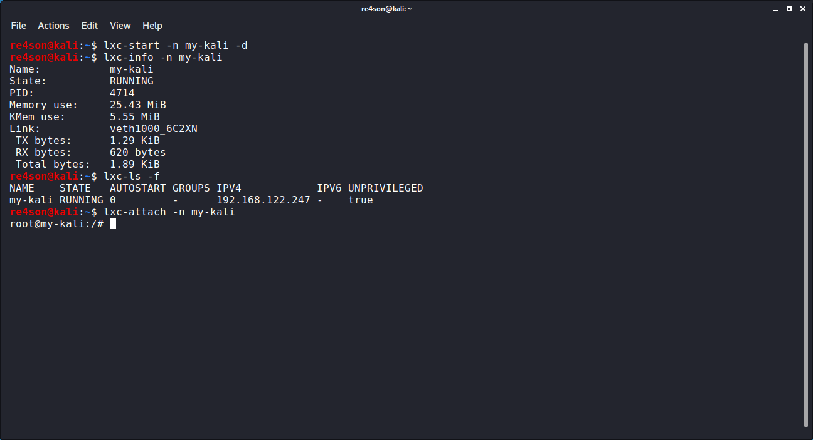
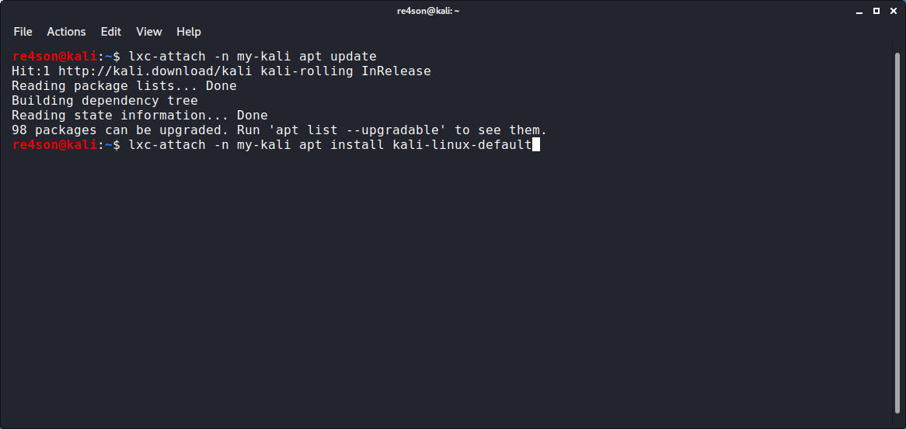

## Content:

- [Overview](#overview)
- [Command line Kali LXD container on Ubuntu host](#command-line-kali-lxd-container-on-ubuntu-host)
- [Gui Kali LXD container on Ubuntu host](#gui-kali-lxd-container-on-ubuntu-host)
- [Privileged Kali LXC container on Kali host](#privileged-kali-lxc-container-on-kali-host)
- [Unprivileged Kali LXC container on Kali host](#unprivileged-kali-lxc-container-on-kali-host)
- [References](#references)

- - -

## Overview

**Kali Linux containers are the ideal solution to**

- **run Kali Linux within other Linux distributions**
- **provide isolated environments for development or testing activities**

**without the overhead of virtual machines.**
**Docker is the preferred solution for applications whilst LXC/LXD are preferred for entire systems.**

Linux containers provide features like snapshots and freezing which comes in very handy when developing or testing software.

Kali images are available on the [image server for LXC and LXD](https://images.linuxcontainers.org/) and can easily be launched either in LXD using the "images:" image server or in LXC using the "lxc-download" template.

LXC is a userspace interface for the Linux kernel containment features. Through a powerful API and simple tools, it lets Linux users easily create and manage system or application containers.

LXD is a next generation system container manager. It offers a user experience similar to virtual machines but using Linux containers instead.
It's image based with pre-made images available for a wide number of Linux distributions and is built around a very powerful, yet pretty simple, REST API.

<u>LXD vs LXC:</u>

LXD is the more convenient of the two but is only available in Ubuntu or other distributions (such as Kali) as snap package.

LXC is available in more distributions and preferred in Kali as it is supported natively and does not required snapd to be running.

- - -

### Command line Kali LXD container on Ubuntu host

Installing a Kali Linux container in Ubuntu only requires a few steps:

1. Install LXD
2. Launch a Kali container
3. Install additional packages inside the container
4. Create non-root user
5. Login

- - -

1 - Install lxd via snap and perform initial setup:

```bash
sudo snap install lxd
lxd init
```


2 - Launch your first Kali Linux container with

```bash
lxc launch images:kali/current/amd64 my-kali
```


3 - Install additional packages inside the container via

```bash
lxc exec my-kali -- apt update
lxc exec my-kali -- apt install kali-linux-default kali-desktop-xfce
```


4 - Create non-root user - "kali" in this example:

```bash
lxc exec my-kali -- adduser kali
lxc exec my-kali -- usermod -aG sudo kali
lxc exec my-kali -- sed -i '1 i\TERM=xterm-256color' /home/kali/.bashrc
lxc exec my-kali -- sh -c "echo 'Set disable_coredump false' > /etc/sudo.conf"
```


5 - Login to the new container as user "kali" via

`lxc console my-kali`




Voila!

##### Container management:

- Start: `lxc start my-kali`
- Stop: `lxc stop my-kali`
- Remove: `lxc destroy my-kali`

- - -

### GUI Kali LXD container on Ubuntu host

Installing a Kali container to run GUI applications is similar to the previous example with a few additional steps:

1. Install LXD
2. Create GUI profile and launch a Kali GUI container
3. Install additional packages inside the container
4. Create non-root user
5. Start Kali Xfce panel
6. Customise Kali Xfce panel

- - -

1 - Install lxd via snap and perform initial setup (if not already done):

```bash
sudo snap install lxd
lxd init
```

2 - Launch your first Kali Linux container with

```bash
wget https://blog.simos.info/wp-content/uploads/2018/06/lxdguiprofile.txt
lxc profile create gui
cat lxdguiprofile.txt | lxc profile edit gui
lxc profile list
lxc launch --profile default --profile gui images:kali/current/amd64    gui-kali
lxc launch images:kali/current/amd64 my-kali```
```


3 - Install additional packages inside the container via

```bash
lxc exec my-kali -- apt update
lxc exec my-kali -- apt install kali-linux-default
```

4 - Create non-root user - "kali" in this example:

```bash
lxc exec my-kali -- adduser kali
lxc exec my-kali -- usermod -aG sudo kali
lxc exec my-kali -- sed -i '1 i\TERM=xterm-256color' /home/kali/.bashrc
lxc exec my-kali -- echo "export DISPLAY=:0" >> /home/kali/.bashrc
lxc exec my-kali -- sh -c "echo 'Set disable_coredump false' > /etc/sudo.conf"
```

5 - Start Kali Xfce panel via

```
lxc exec gui-kali -- sudo -u kali xfce4-panel
```


Customise the panel as desired.

##### Container management:

- Start: `lxc start my-kali`
- Stop: `lxc stop my-kali`
- Remove: `lxc destroy my-kali`

- - -

### Privileged Kali LXC container on Kali host

Privileged containers are containers created by root and running as root. They are quicker to setup than unprivileged  containers but are inherently unsafe.
Installing a privileged Kali Linux container on a Kali host only requires to:

1. Install and setup lxc
2. Download the kali image from the image server
3. Start the container
4. Attach to the container

- - -

1 - Install lxc and setup the network:

```bash
sudo apt install -y lxc libvirt0 libpam-cgfs bridge-utils libvirt-clients libvirt-daemon-system iptables ebtables dnsmasq-base

sudo cat <<EOF > /etc/lxc/default.conf
lxc.net.0.type = veth
lxc.net.0.link = virbr0
lxc.net.0.flags = up
lxc.apparmor.profile = generated
lxc.apparmor.allow_nesting = 1
EOF

sudo virsh net-start default
sudo virsh net-autostart default
```


2 - Download the Kali Linux image from the image server via

`lxc-create -t download -n my-kali`


This will list all available images.


When prompted, enter:

- Distribution: *kali*
- Release: *current*
- Architecture: *amd64* (or other as applicable)


3 - Start the container with

```
sudo lxc-start -n my-kali -d
````


4 - Attach to the container via

```
sudo lxc-attach -n my-kali
```


There you have it. Next you should set a root password and install the "kali-linux-default" metapackage.

##### Container management:

- Start: `sudo lxc-start -n my-kali -d`
- Stop: `sudo lxc-stop -n my-kali`
- List: `sudo lxc-ls -f`
- Info: `sudo lxc-info -n my-kali`
- Remove: `sudo lxc-destroy -n my-kali`

- - -

### Unprivileged Kali LXC container on Kali host

Unprivileged containers run in a user context and are considered safer and are preferred over using privileged container.
The setup it slightly more involved:

1. Install and setup lxc
2. Setup LXC for unprivileged containers
3. Download the kali image from the image server
4. Start the container
5. Install some additional packages
6. Create non-root user
7. Login

- - -

1 - Install lxc (if required):

```bash
sudo apt install -y lxc libvirt0 libpam-cgfs bridge-utils libvirt-clients libvirt-daemon-system iptables ebtables dnsmasq-base
```
2 - Setup LXC for unprivileged containers

```bash
echo "$USER veth virbr0 10"| sudo tee -i /etc/lxc/lxc-usernet
sudo sh -c 'echo "kernel.unprivileged_userns_clone=1" > /etc/sysctl.d/80-lxc-userns.conf'
sudo sysctl kernel.unprivileged_userns_clone=1
sudo chmod u+s /usr/libexec/lxc/lxc-user-nic

mkdir -p ~/.config/lxc
cp /etc/lxc/default.conf ~/.config/lxc/default.conf
sed -i 's/lxc.apparmor.profile = generated/lxc.apparmor.profile = unconfined/g' ~/.config/lxc/default.conf
```

Next we have to add two lines into `~/.config/lxc/default.conf` whose    subuid & subguid match those listed in `/etc/subuid` and `/etc/subgid`.
First let's get the id's via `cat  /etc/s*id|grep $USER`
The result should look like this:

```bash
kali:100000:65536
kali:100000:65536
```

Substitute the ID's in the following commands with the ones in the previous output:

```bash
echo lxc.idmap = u 0 100000 65536 >> ~/.config/lxc/default.conf
echo lxc.idmap = g 0 100000 65536 >> ~/.config/lxc/default.conf
```


3 - Download the Kali Linux image from the image server via

```
lxc-create -t download -n my-kali
```



This will list all available images.


When prompted, enter:

- Distribution: *kali*
- Release: *current*
- Architecture: *amd64* (or other as applicable)


4 - Start the container with

```bash
lxc-start -n my-kali -d
```

But before we login, we perform some post-installation setup tasks

5 - Install default packages:
```bash
lxc-attach -n my-kali apt update
lxc-attach -n my-kali apt install kali-linux-default
```


6 - Create a non-root user:

```bash
lxc-attach -n my-kali --clear-env adduser <username>
lxc-attach -n my-kali --clear-env adduser <username> sudo
```


7 - Login as non-root user via

```bash
lxc-console
```

And perform the following on initial login to get some colors in the console:

```bash
sed -i '1 i\TERM=xterm-256color' ~/.bashrc
. ~/.bashrc
```


##### Container management:

- Start: `sudo lxc-start -n my-kali -d`
- Stop: `sudo lxc-stop -n my-kali`
- List: `sudo lxc-ls -f`
- Info: `sudo lxc-info -n my-kali`
- Remove: `sudo lxc-destroy -n my-kali`

- - -

## References:

- [Linux Containers](https://linuxcontainers.org/)
- [How to run GUI apps in LXD containers on your Ubuntu desktop](https://blog.simos.info/how-to-easily-run-graphics-accelerated-gui-apps-in-lxd-containers-on-your-ubuntu-desktop/)
