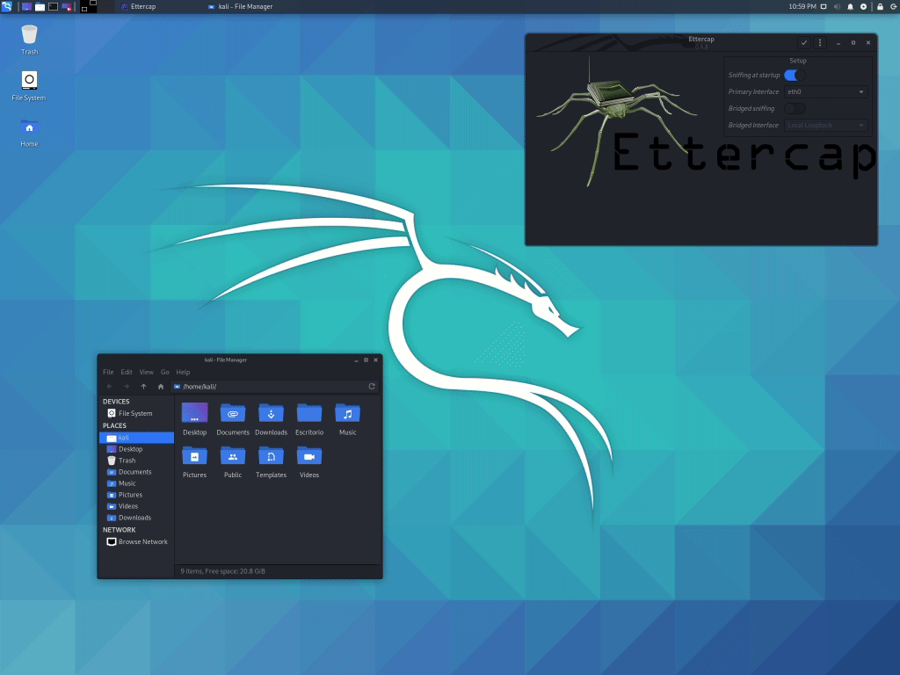
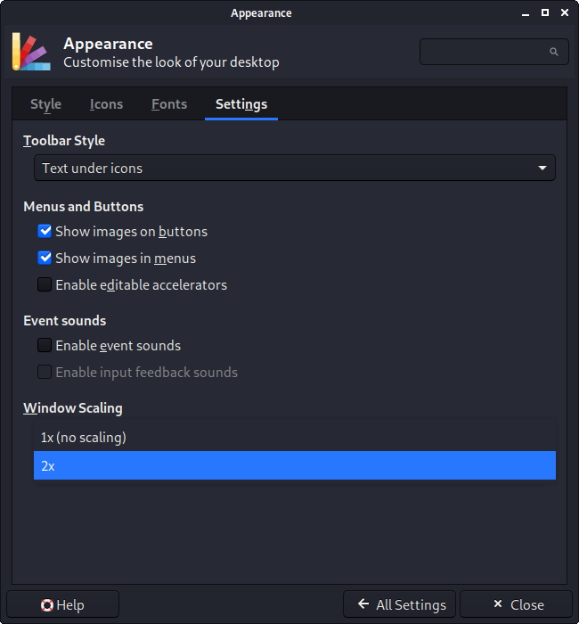

Upon starting Kali Linux up, certain things (**Windows/buttons** or **text/font**) may appear **smaller than expected**. This could be because of **HiDPI** (aka **High DPI**). It all depends on the software in question, with how it was made, (e.g. GTK2, GTK3, Qt5 etc). This could be happening for various reasons, such as the graphic card drivers and/or the monitor profile.

If things are looking **larger** than what you would believe to be "normal", please see our [Fixing DPI guide](/docs/general-use/fixing-dpi/).

This guide will cover single screen setups. **We do not have the hardware in order to test multiple display outputs to write up the guide. So we are looking for [community contribution](/docs/community/contribute/) to help out. If you have the hardware, and expertise, please [edit this guide](https://gitlab.com/kalilinux/documentation/kali-docs/edit/master/general-use/hidpi/index.md)!**

## Desktop Environments - Xfce

Xfce does support HiDPI monitors. Though you may need to alter a few places, depending on your hardware, versions and issues to get it working.


In order to make this process easier, Kali now provides a HiDPI mode. This mode adjusts the scaling-factor for GTK, QT and even Java based interfaces, so that the user doesn't need to modify each one of them manually. You can toggle it by opening 'Kali HiDPI mode' from the applications menu or by running `kali-hidpi-mode` from the terminal.



Even though kali-hidpi-mode is able to alter the scaling-factor without the need of restarting, it is recommended to close the session and login again to ensure all changes are properly applied.

Below is more of an explanation for a manual setting.

### Scaling Factor

#### GTK

After logging into Kali, the wallpaper may look "normal", but everything else might be "a little small to read".


Increasing the "**Scaling Factor**" from "**x1**" to "**x2**" should address this problem. You have two ways todo this, either through the command line or graphical:

- In a terminal window, run the following commands:

```
kali@kali:~$ echo export GDK_SCALE=2 >> ~/.xsessionrc
kali@kali:~$
kali@kali:~$ xfconf-query -c xfwm4 -p /general/theme -s Kali-Dark-xHiDPI
kali@kali:~$
kali@kali:~$ xfconf-query -c xsettings -p /Gdk/WindowScalingFactor -n -t 'int' -s 2
kali@kali:~$
```

- Graphical:
  - Kali -> Settings -> Appearance -> **Settings** -> **Windows Scaling**
  - Kali -> Settings -> Appearance -> **Window Manager** -> **Theme: `Kali-Dark-xHiDPI`**





The quickest way to clean up any left over artifacts is to **log out and in again**.

#### Qt

Some apps, such as [qTerminal](https://packages.debian.org/testing/qterminal), don't use the scale factor explained before, so they need to be configure separately.

To do so, you need to set the following environmental variables in the `~/.xsessionrc` file:

```
kali@kali:~$ echo export QT_SCALE_FACTOR=2 >> ~/.xsessionrc
kali@kali:~$
```

### Cursor size

Enabling HiDPI settings can cause some issues with the mouse size, and you might see how its size varies depending on the application you place it over.

To solve this, you can force the cursor size with the following command:

```
kali@kali:~$ echo export XCURSOR_SIZE=48 >> ~/.xsessionrc
kali@kali:~$
```

{}
You may need to try increasing the value from `48`.
{}

- - -

## Login Screen - LightDM

Are you experiencing an issue with the login screen (`lightdm`), with the login box being smaller than "normal"?


A possible solution would be to set "`xft-dpi`" to "`180` (**or higher**):

```
kali@kali:~$ grep xft-dpi /etc/lightdm/lightdm-gtk-greeter.conf
xft-dpi = 96
kali@kali:~$
kali@kali:~$ sudo vim /etc/lightdm/lightdm-gtk-greeter.conf
kali@kali:~$
kali@kali:~$ cat /etc/lightdm/lightdm-gtk-greeter.conf
[greeter]
...SNIP...
xft-dpi = 180
...SNIP...
kali@kali:~$
```

{}
You may need to try increasing the value from `180`.
{}
