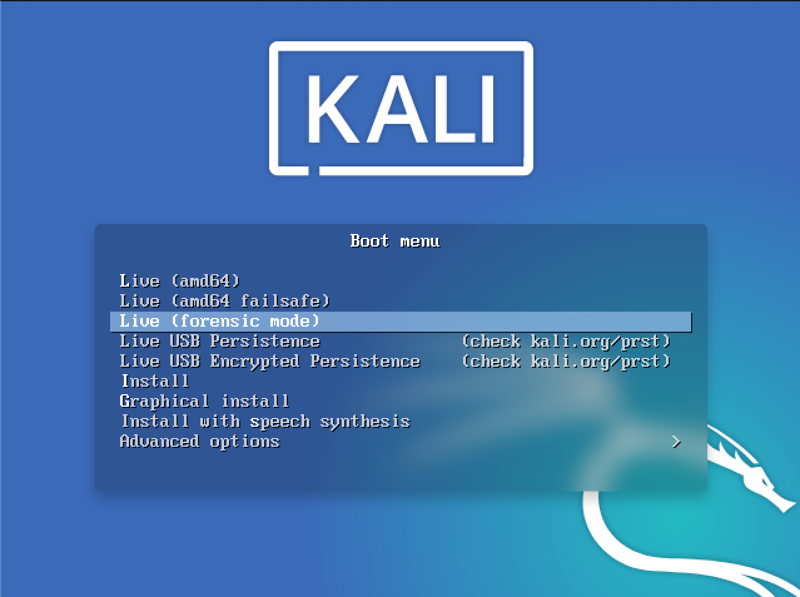

Kali Linux "Live" provides a "forensic mode", a feature first introduced in BackTrack Linux. The "Forensic mode live boot" option has proven to be very popular for several reasons:

* Kali Linux is widely and easily available, many potential users already have Kali ISOs or bootable USB drives.
* When a forensic need comes up, Kali Linux "Live" makes it quick and easy to put Kali Linux on the job.
* Kali Linux comes pre-loaded with the most popular open source forensic software, a handy toolkit when you need to do forensic work.

When booted into the forensic boot mode, there are a few _very important changes_ to the regular operation of the system:

1. First, the internal hard disk is _never_ touched. If there is a swap partition it will _not_ be used and no internal disk will be auto mounted. We verified this by first taking a standard system and removing the hard drive. A hash was taken of the drive using a commercial forensic package. We then reattached the drive to the computer and booted Kali Linux "Live" in forensic mode. After using Kali for a period of time, we then shut the system down, removed the hard drive, and took the hash again. These hashes matched, indicating that at no point was anything changed on the drive in any way.

2. The other, equally important, change is that auto-mounting of removable media is **_disabled_**. USB thumb drives, CDs, and the like will **_not_** be auto-mounted when inserted. The idea behind this is simple: in forensic mode, **_nothing_** should happen to _**any**_ media without _**direct user action**_. _Anything_ that you do as a user is _on you_.

If you plan on using Kali for real world forensics of any type, we recommend that you don't just take our word for any of this. All forensic tools should _always_ be validated to ensure that you know how they will behave in any circumstance in which you are going to be using them.
Finally, while Kali continues to focus on providing the best collection of open source penetration testing tools available, it is always possible that we may have missed _your_ favorite open source forensic tool. If so, [let us know](http://bugs.kali.org)! We are always on the lookout of high quality open source tools that we can add to Kali to make it even better.
