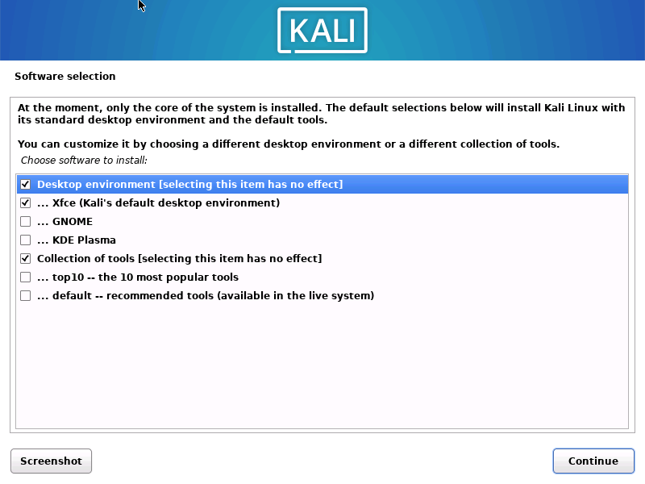

Kali traditionally has been solely recommended as a penetration testing distribution, and for good reason. However, through the years Kali has become more stable and evolved into something that users can use no matter what their reasoning is. While still primarily a penetration testing distribution, we accept that many users may not even be in the cybersecurity field. For those users wanting to install Kali, but may not need the tools or just want the UI, this guide is for you.

## Installing a bare-bones Kali

To get a Kali without any tools is quite easy. We will be following the [hard disk install](/docs/installation/hard-disk-install/) for the most part. The important part is to select the following packages:



Of course, you can select whichever desktop environment you wish. It is worth mentioning now that KDE has great support for Wacom tablets! Be careful not to mix KDE with another desktop distribution however, as there are some bugs that can occur when this happens.

Now that we are installed and logged in, there are a few things we should do. Keep in mind, these should always be done, not just for a daily use case! Let's first change the root user's password:

```console
kali@kali:~$ sudo su
[sudo] password for kali:
root@kali:/home/kali#
root@kali:/home/kali# passwd
New password:
Retype new password:
passwd: password updated successfully

root@kali:/home/kali#
```

After this we can make sure our system is up-to-date:

```console
kali@kali:~$ sudo apt update && sudo apt upgrade -y
....
kali@kali:~$
kali@kali:~$ [ -f /var/run/reboot-required ] && sudo reboot -f
```

We can now finish off our setup by making sure kali-tweaks is configured properly:

```console
kali@kali:~$ kali-tweaks
```

What we are looking for are changes required in 'Hardening', unchecking any options to make our system more secure.
