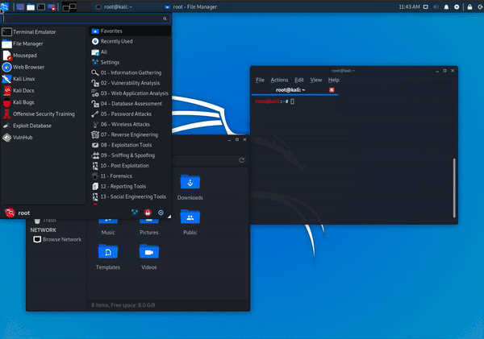

**Kali Undercover** is a set of scripts that changes the look and feel of your Kali Linux desktop environment to **Windows 10** desktop environment, like _magic_.

It was released with [**Kali Linux 2019.4**](/blog/kali-linux-2019-4-release/) with an important concept in mind, *to hide in plain sight*.



#### Going "undercover"

Switching to undercover mode is pretty straight-forward, just run the following command:

```console
kali@kali:~$ kali-undercover
kali@kali:~$
```

or, you can also look for **"Kali Undercover Mode"** from menu of your desktop and launch it.

**Swoosh!** Now, you are completely _(almost)_ invisible. The script will turn your desktop environment's look and feel similar to that of Windows 10.

#### Reverting Back

Now, to **revert** back into your previous desktop settings just re-enter the previous command:

```console
kali@kali:~$ kali-undercover
kali@kali:~$
```

**Ta-da!** Welcome back! Now, all your desktop settings should be restored to.

- - -

#### Purpose of Undercover Mode in Kali Linux

The main purpose of introducing **Kali Undercover** mode is **to prevent any unnecessary attention** while using Kali Linux in _public_.

Let's imagine a scenario: you are ethically pentesting your client and you are in their office or reception doing reconnaissance or something that involves the use of **Kali Linux**.

What if someone from your client's office or some random on-looker spot your desktop environment/wallpaper of Kali Linux and they might think you are doing something mischievous even though you are doing it _ethically_ and warn the authority. All the hard work that you did from the beginning to become stealthy will go in vain. That also because of what? A **wallpaper**! For a client who requested you to become stealthy, this is not what you would want.

Hence, to prevent any kind of unwanted attention from public its better to go **"Undercover!"**.
