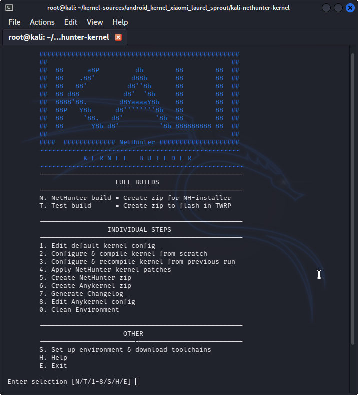

In order to port NetHunter to a new device, it's important to understand how NetHunter is separated. NetHunter is divided by the rootfs (also known as the chroot but will be referred to here as rootfs) and the kernel. For the most part, the rootfs is not important to your Android device as it only contains Kali Linux. The kernel is integral to getting things like Bluetooth, wireless USB, and HID keyboard (etc) working.

You also need a device with an unlocked bootloader, for flashing the kernel, and you must be able to get root on the device. Root is needed so we can write applications to system, such as busybox and bootkali, and execute commands that allow us to get Kali running.

**If you are looking to port a device, it's all about the kernel. Device must be unlockable/rootable**.

## Getting Started

Let's assume that you've already followed the directions on the [main docs page](/docs/nethunter/building-nethunter/). You have all the dependencies met and you are ready to go. The first thing we want to do is build a test kernel.

## Kernel Version

If your device is older, please check to make sure your kernel version is 3.4+ and above. With the switch to kali rolling we are starting to see errors inside chroot where the kernel is not able to support loading Kali.

## Finding Kernel Sources

One of the reasons why Nexus was chosen is because all kernel sources are made available through [Google's own website](https://android.googlesource.com). Finding sources can be easy or difficult depending on the manufacturer. A good resource is usually the [XDA forums](https://forum.xda-developers.com/) as someone else has probably already built a working kernel and they must provide the sources under GPL. Most kernel development pages on XDA must provide a link to their sources.

## Making a Test Kernel

Assuming you don't have a toolchain downloaded already, you can begin by cloning our kernel builder to the root of your kernel's folder, and prepare the environment:

```console
kali@kali:~$ git clone https://gitlab.com/kalilinux/nethunter/build-scripts/kali-nethunter-kernel
kali@kali:~$ cd kali-nethunter-kernel
```

Find your best matching local.config example file, modify if necessary, and copy to kernel builder folder:

```console
kali@kali:~$ cp local.config.examples/local.config.example.sdm660 local.config
kali@kali:~$ ./build.sh
```



Select ***S. Setup Environment and download toolchains***.
When ready, build your test kernel with ***2. Configure & compile kernel from scratch***

Select your device's defconfig, then save and exit to start the building process.

If the build was successful, add your device details like codename, boot_block, slot_device, etc with ***8. Edit Anykernel config***
Create your first test kernel installer with ***6. Create Anykernel zip***

Now flash your kernel to see it in action!

Please note if you will continue and modify the kernel, you can use ***3. Configure & recompile kernel from previous run*** to save time.
