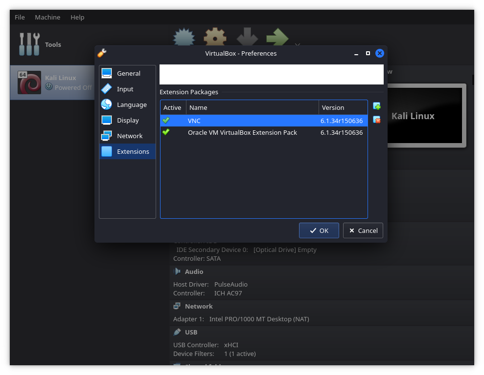
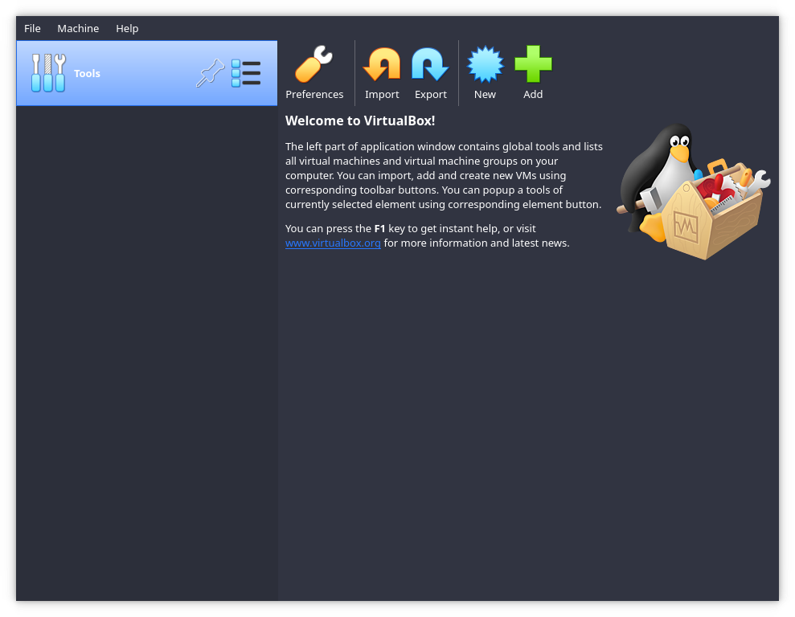
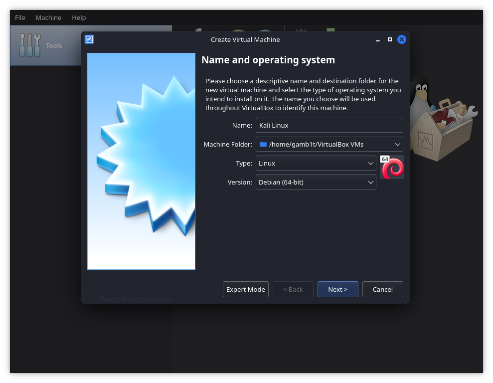
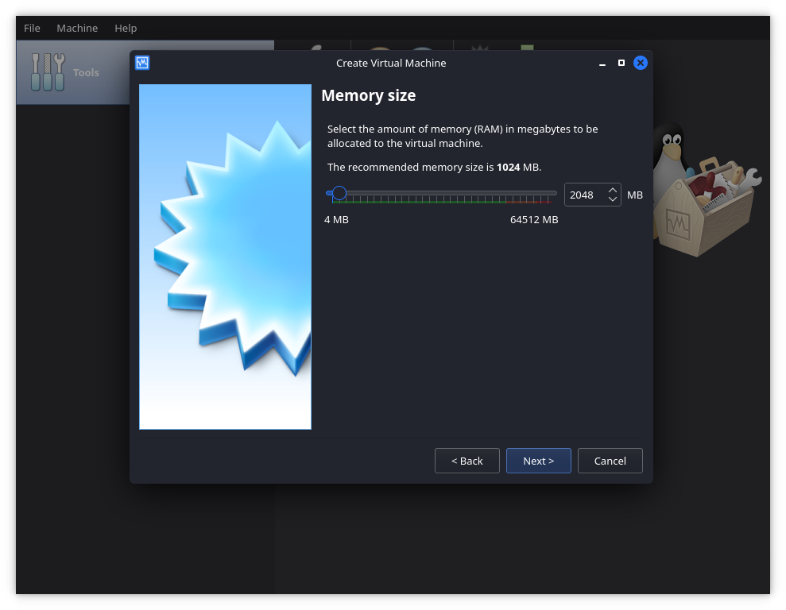
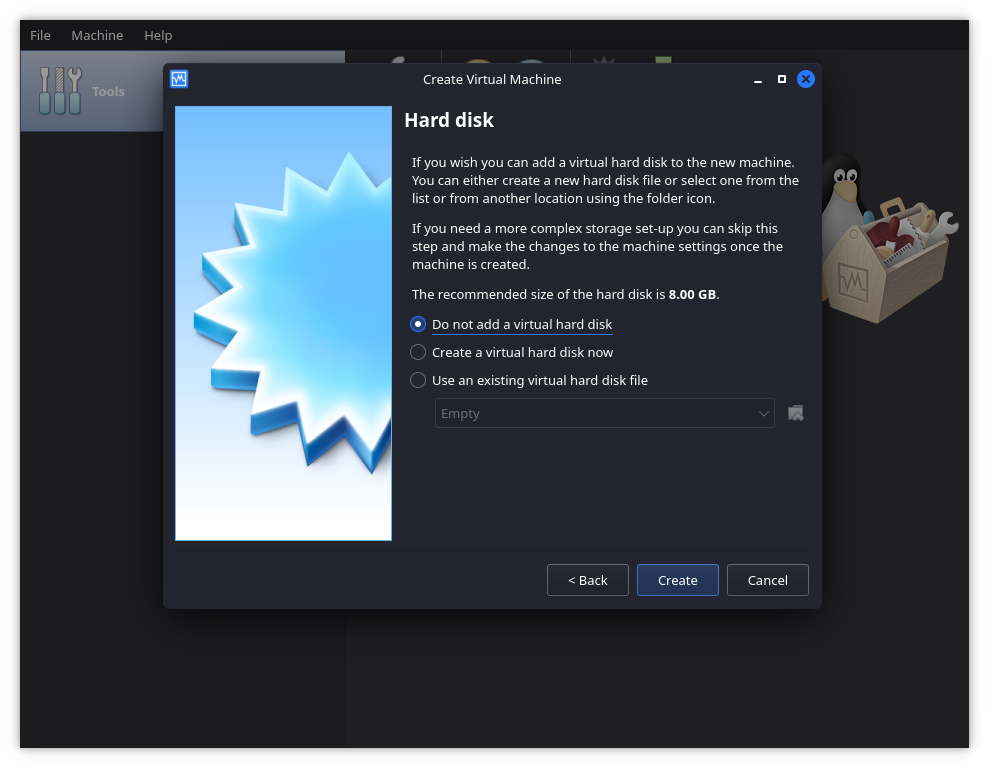
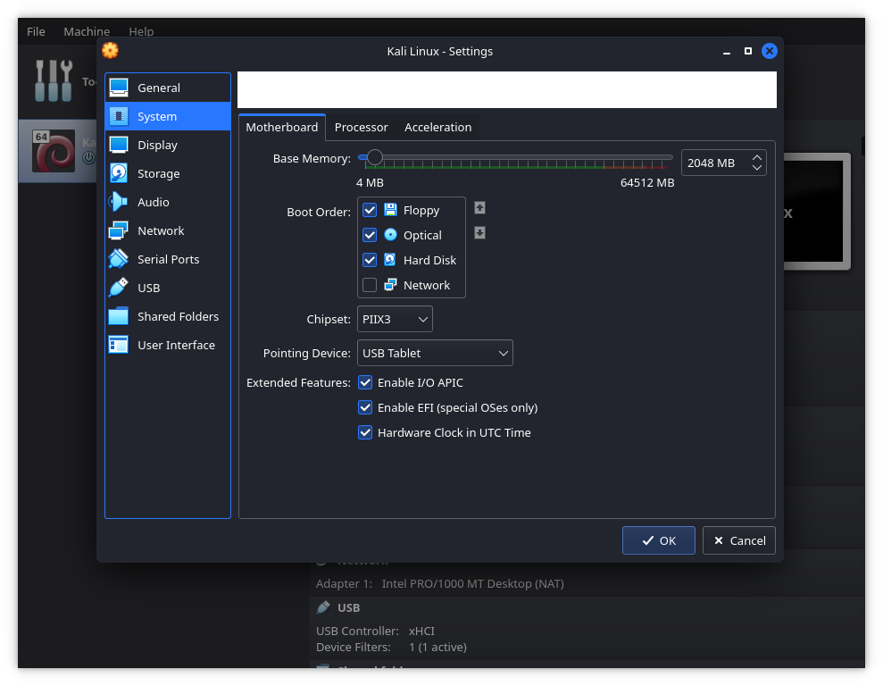
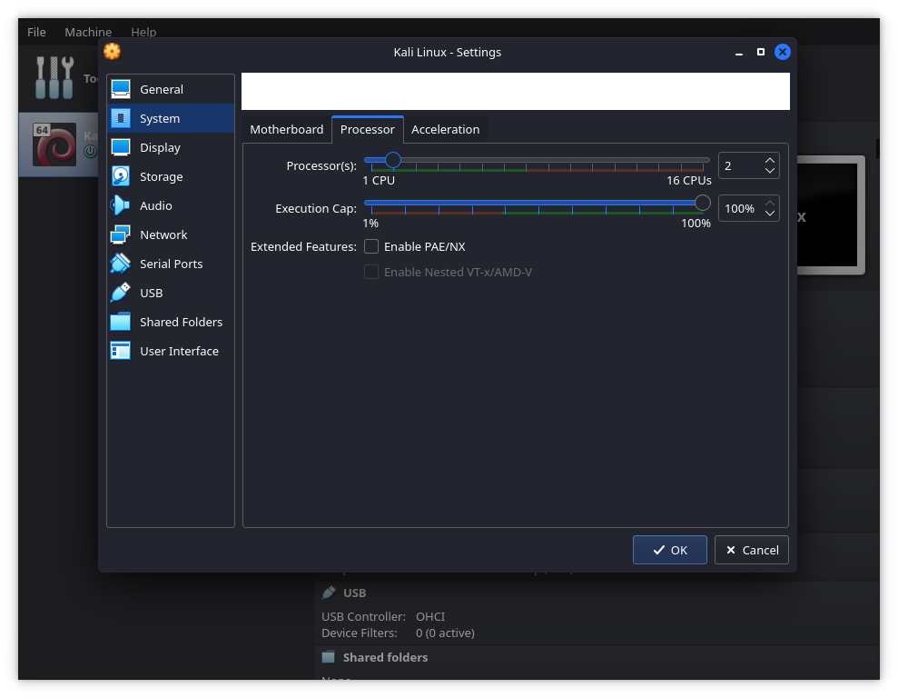
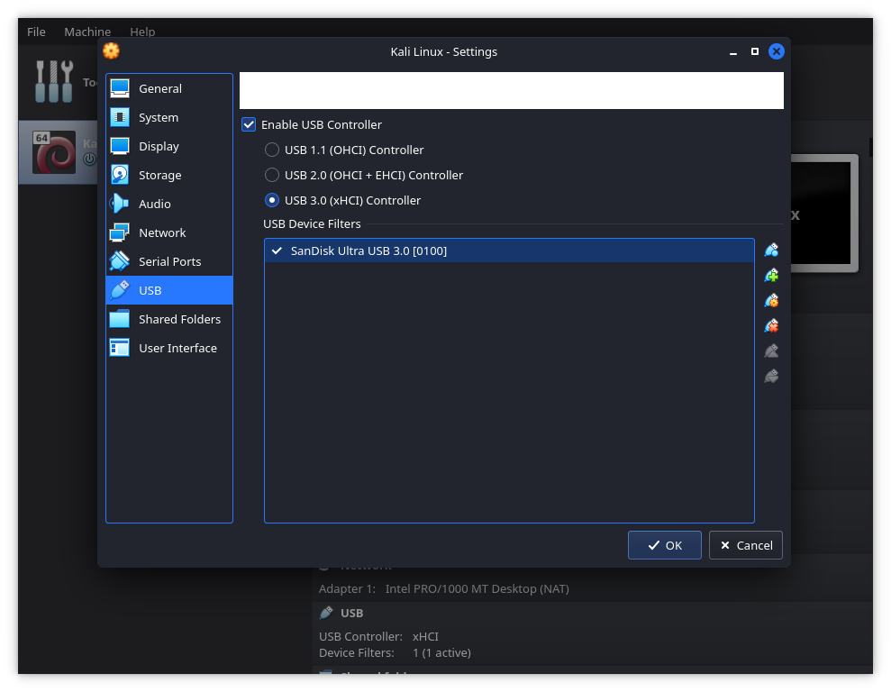

To get started we first will need to download the [Oracle VM VirtualBox Extension Pack](https://www.virtualbox.org/wiki/Downloads). After downloading this pack we can launch VirtualBox and select 'Preferences' under the 'File' tab. From here we navigate to 'Extensions' and select box with a green plus and add the pack.



After this we will need to be sure to add our account to the `vboxusers` group if we are on Linux.

```
┌──(kali㉿kali)-[~]
└─$ sudo usermod -aG vboxusers $USER

┌──(kali㉿kali)-[~]
└─$
```

We then have to log out and log back in. We can now continue with USB 2.0/3.0 access. Lets start with a fresh opening of VirtualBox.



From here we will be creating a new VM. We can name it whatever we want and select 'Linux' as the type and 'Debian (64-bit)' as the version.



We can continue forward selecting 2GB of memory.



We want to be sure to not create a virtual hard disk. This will ask for confirmation, confirm it and continue.



We can now edit our settings. Under 'Motherboard' in 'System' we will be enabling EFI.



Next under 'Processor' in 'System' we will be increasing the processor amount to 2.



Now we navigate to 'USB' and we select the USB icon with the green plus. We add our Kali Live USB drive and ensure we are set to USB 3.0.



We can now complete the setup and boot the VM. We should get the Live Boot menu if all went correctly.
