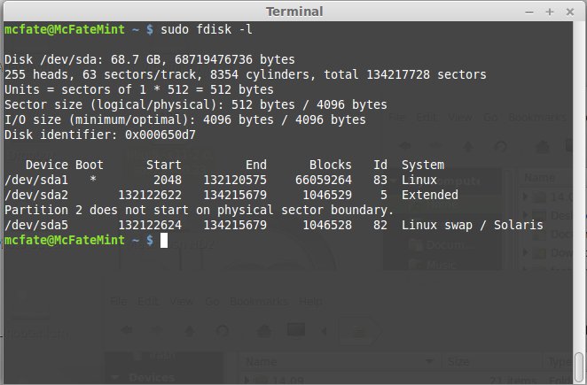
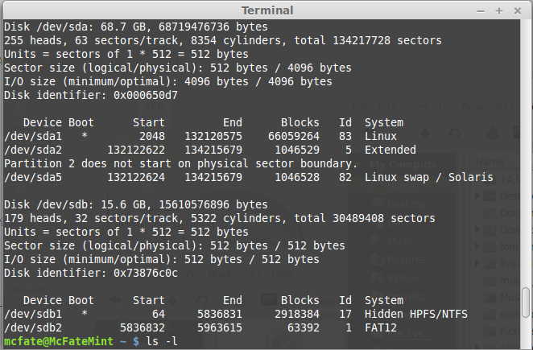

Our favourite way, and the fastest method, for getting up and running with Kali Linux is to run it "live" from a USB drive. This method has several advantages:

- It's non-destructive — it makes no changes to the host system's hard drive or installed OS, and to go back to normal operations, you simply remove the "Kali Live" USB drive and restart the system.
- It's portable — you can carry Kali Linux in your pocket and have it running in minutes on an available system
- It's customizable — you can [roll your own custom Kali Linux ISO image](/docs/development/live-build-a-custom-kali-iso/) and put it onto a USB drive using the same procedures
- It's potentially persistent — with a bit of extra effort, you can configure your Kali Linux "live" USB drive to have [persistent storage](/docs/usb/usb-persistence/), so the data you collect is saved across reboots

In order to do this, we first need to create a bootable USB drive which has been set up from an ISO image of Kali Linux.

## What You'll Need

1. A _verified_ copy of the appropriate ISO image of the latest Kali build image for the system you'll be running it on: see the details on [downloading official Kali Linux images](/docs/introduction/download-official-kali-linux-images/).

2. If you're running under Linux, you can use the `dd` command, which is pre-installed, or use [Etcher](https://www.balena.io/etcher/).

3. A USB thumb drive, 4GB or larger. (Systems with a direct SD card slot can use an SD card with similar capacity. The procedure is identical.)

## Kali Linux Live USB Install Procedure

The specifics of this procedure will vary depending on whether you're doing it on a [Windows](/docs/usb/live-usb-install-with-windows/), [Linux](/docs/usb/live-usb-install-with-linux/), or [macOS/OS X](/docs/usb/live-usb-install-with-mac/) system.

#### Creating a Bootable Kali USB Drive on Linux (DD)

Creating a bootable Kali Linux USB key in a Linux environment is easy. Once you've downloaded and verified your Kali ISO file, you can use the `dd` command to copy it over to your USB stick using the following procedure. Note that you'll need to be running as root, or to execute the `dd` command with sudo. The following example assumes a Linux Mint 17.1 desktop — depending on the distro you're using, a few specifics may vary slightly, but the general idea should be very similar. If you would prefer to use Etcher, then follow the same directions as a Windows user. Note that the USB drive will have a path similar to /dev/sdb.

{}
WARNING: Although the process of imaging Kali Linux onto a USB drive is very easy, you can just as easily overwrite a disk drive you didn't intend to with dd if you do not understand what you are doing, or if you specify an incorrect output path. Double-check what you're doing before you do it, it'll be too late afterwards.

Consider yourself warned.
{}

1. First, you'll need to identify the device path to use to write the image to your USB drive. **_Without_** the USB drive inserted into a port, execute the command `sudo fdisk -l` at a command prompt in a terminal window (if you don't use elevated privileges with fdisk, you won't get any output). You'll get output that will look something (_not exactly_) like this, showing a single drive — "/dev/sda" — containing three partitions (/dev/sda1, /dev/sda2, and /dev/sda5):


2. Now, plug your USB drive into an available USB port on your system, and run the same command, "sudo fdisk -l" a second time. Now, the output will look something (again, _not exactly_) like this, showing an additional device which wasn't there previously, in this example "/dev/sdb", a 16GB USB drive:


3. Proceed to (carefully!) image the Kali ISO file on the USB device. The example command below assumes that the ISO image you're writing is named "kali-linux-2020.4-live-amd64.iso" and is in your current working directory. The blocksize parameter can be increased, and while it may speed up the operation of the dd command, it can occasionally produce unbootable USB drives, depending on your system and a lot of different factors. The recommended value, "bs=4M", is conservative and reliable.

```console
kali@kali:~$ dd if=kali-linux-2020.4-live-amd64.iso of=/dev/sdb bs=4M
```

Imaging the USB drive can take a good amount of time, over ten minutes or more is not unusual, as the sample output below shows. Be patient!

The `dd` command provides no feedback until it's completed, but if your drive has an access indicator, you'll probably see it flickering from time to time. The time to `dd` the image across will depend on the speed of the system used, USB drive itself, and USB port it's inserted into. Once `dd` has finished imaging the drive, it will output something that looks like this:

```plaintext
5823+1 records in
5823+1 records out
3053371392 bytes (3.1 GB) copied, 746.211 s, 4.1 MB/s
```

That's it, really!

- - -

#### Creating a Bootable Kali USB Drive on Linux (DD with status)

Alternatively there are a few other options available for imaging.

The first option is `dd` with a status indicator. This is only available on newer systems however. To do this, we simply add the `status` flag.

```console
kali@kali:~$ dd if=kali-linux-2020.4-live-amd64.iso of=/dev/sdb bs=4M status=progress
```

Another option is to use `pv`. We can also use the `size` flag here to get an approximate timer. Change the size depending on the image being used.

```console
kali@kali:~$ dd if=kali-linux-2020.4-live-amd64.iso | pv -s 2.8G | dd of=/dev/sdb bs=4M
```

#### Creating a Bootable Kali USB Drive on Linux (Etcher)

The third is [Etcher](https://www.balena.io/etcher/).

1. Download and run Etcher.

2. Choose the Kali Linux ISO file to be imaged with "select image" and verify that the USB drive to be overwritten is the correct one. Click the "Flash!" button once ready.


3. Once Etcher alerts you that the image has been flashed, you can safely remove the USB drive.

You can now boot into a Kali Live / Installer environment using the USB device.
