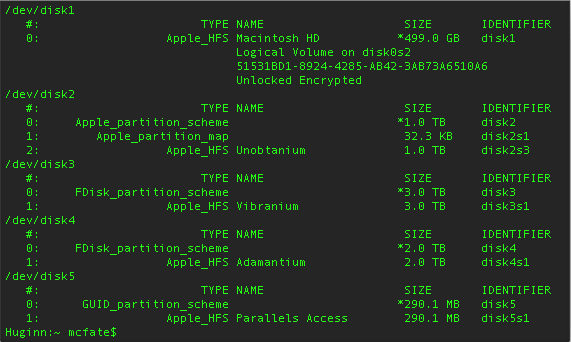
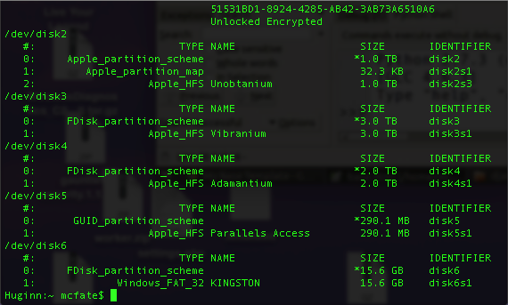

Our favourite way, and the fastest method, for getting up and running with Kali Linux is to run it "live" from a USB drive. This method has several advantages:

- It's non-destructive — it makes no changes to the host system's hard drive or installed OS, and to go back to normal operations, you simply remove the "Kali Live" USB drive and restart the system.
- It's portable — you can carry Kali Linux in your pocket and have it running in minutes on an available system
- It's customizable — you can [roll your own custom Kali Linux ISO image](/docs/development/live-build-a-custom-kali-iso/) and put it onto a USB drive using the same procedures
- It's potentially persistent — with a bit of extra effort, you can configure your Kali Linux "live" USB drive to have [persistent storage](/docs/usb/usb-persistence/), so the data you collect is saved across reboots

In order to do this, we first need to create a bootable USB drive which has been set up from an ISO image of Kali Linux.

## What You'll Need

1. A _verified_ copy of the appropriate ISO image of the latest Kali build image for the system you'll be running it on: see the details on [downloading official Kali Linux images](/docs/introduction/download-official-kali-linux-images/).

2. If you're running under macOS/OS X, you can use the `dd` command, which is pre-installed on those platforms, or use [Etcher](https://www.balena.io/etcher/).

3. A USB thumb drive, 4GB or larger. (Systems with a direct SD card slot can use an SD card with similar capacity. The procedure is identical.)

## Kali Linux Live USB Install Procedure

The specifics of this procedure will vary depending on whether you're doing it on a [Windows](/docs/usb/live-usb-install-with-windows/), [Linux](/docs/usb/live-usb-install-with-linux/), or [macOS/OS X](/docs/usb/live-usb-install-with-mac/) system.

#### Creating a Bootable Kali USB Drive on macOS/OS X (DD)

macOS/OS X is based on UNIX, so creating a bootable Kali Linux USB drive in an macOS/OS X environment is similar to doing it on Linux. Once you've downloaded and verified your chosen Kali ISO file, you use `dd` to copy it over to your USB stick. If you would prefer to use Etcher, then follow the same directions as a Windows user. Note that the USB drive will have a path similar to /dev/disk2.

{}
WARNING: Although the process of imaging Kali on a USB drive is very easy, you can just as easily overwrite a disk drive you didn't intend to with dd if you do not understand what you are doing, or if you specify an incorrect output path. Double-check what you're doing before you do it, it'll be too late afterwards.

Consider yourself warned.
{}

1. **_Without_** the USB drive plugged into the system, open a Terminal window, and type the command `diskutil list` at the command prompt.

2. You will get a list of the device paths (looking like **/dev/disk0**, **/dev/disk1**, etc.) of the disks mounted on your system, along with information on the partitions on each of the disks.


3. Plug in your USB device to your Apple computer's USB port and run the command `diskutil list` a second time. Your USB drive's path will most likely be the last one. In any case, it will be one which wasn't present before. In this example, you can see that there is now a **/dev/disk6** which wasn't previously present.


4. Unmount the drive (assuming, for this example, the USB stick is **/dev/disk6** — _do **not** simply copy this, verify the correct path on your own system!_):

```console
$ diskutil unmountDisk /dev/disk6
```

5. Proceed to (carefully!) image the Kali ISO file on the USB device. The following command assumes that your USB drive is on the path /dev/disk6, and you're in the same directory with your Kali Linux ISO, which is named "kali-linux-2020.4-live-amd64.iso". We will replace /dev/disk6 with /dev/rdisk6 to improve the write speeds:

```console
$ sudo dd if=kali-linux-2020.4-live-amd64.iso of=/dev/rdisk6 bs=4m
```

{}
Increasing the blocksize (bs) will speed up the write progress, but will also increase the chances of creating a bad USB stick. Using the given value on macOS/OS X has produced reliable images consistently.
{}

Imaging the USB drive can take a good amount of time, over half an hour is not unusual, as the sample output below shows. Be patient!

The dd command provides no feedback until it's completed, but if your drive has an access indicator, you'll probably see it flickering from time to time. The time to `dd` the image across will depend on the speed of the system used, USB drive itself, and USB port it's inserted into. Once dd has finished imaging the drive, it will output something that looks like this:

```plaintext
2911+1 records in
2911+1 records out
3053371392 bytes transferred in 2151.132182 secs (1419425 bytes/sec)
```

And that's it!

- - -

#### Creating a Bootable Kali USB Drive on macOS/OS X (Etcher)

Alternatively, [Etcher](https://www.balena.io/etcher/) can be used.

1. Download and run Etcher.

2. Choose the Kali Linux ISO file to be imaged with "select image" and verify that the USB drive to be overwritten is the correct one. Click the "Flash!" button once ready.


3. Once Etcher alerts you that the image has been flashed, you can safely remove the USB drive.

You can now boot into a Kali Live / Installer environment using the USB device.

To boot from an alternate drive on an macOS/OS X system, bring up the boot menu by pressing the **Option** key immediately after powering on the device and select the drive you want to use.

For more information, see [Apple's knowledge base](https://support.apple.com/kb/ht1310).
