A few years ago we released a blog post on [VMware Fusion Kali USB Boot](/blog/vmware-fusion-kali-usb-boot/). This can come in handy if a USB is not working how it should, as it can reduce time from needing to reboot or transfer it to another machine. Since then there have been some updates to VMware Fusion that make this process a bit easier.

As a review, we will be creating a VM that has no hard drive attached and will boot the USB off of EFI.

### Process

Create a new custom VM

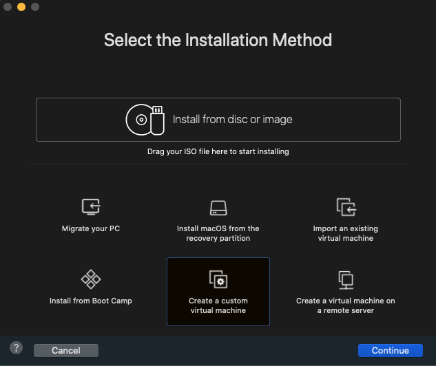

Be sure to select "Linux" and the latest Debian 64-bit version

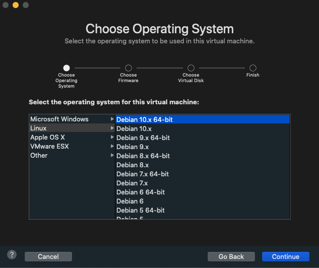

Select "UEFI" as the boot option.

Create a new virtual disk (This will be removed later)

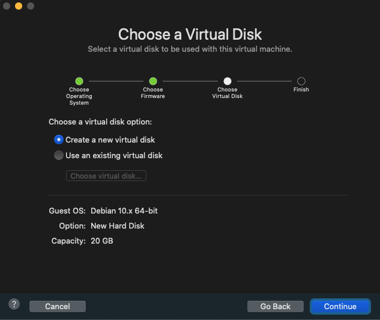

Click "Customize Settings"

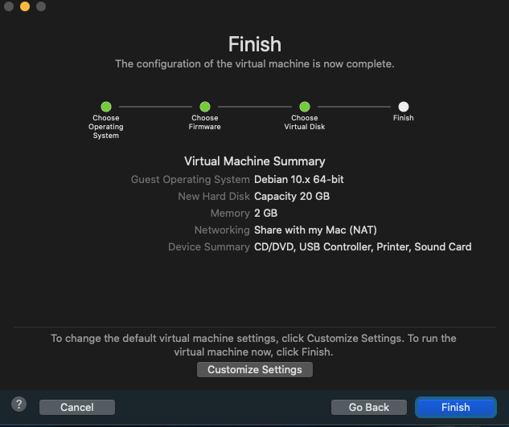

Give it a name you will remember

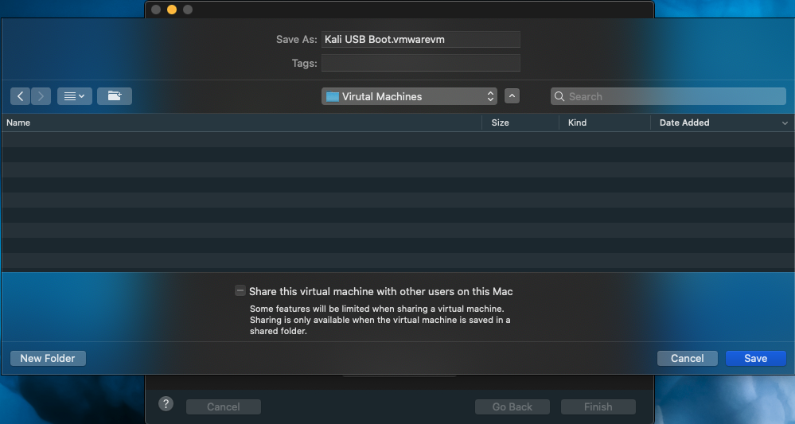

In settings, click Processor and Memory. Ensure at least 2048MB memory is allocated, and at least 2 cores.

Next, in "Display", check "Accelerate 3D Graphics". This is an optional option, however it improves the performance. Optionally, check "Use full resolution for Retina display".

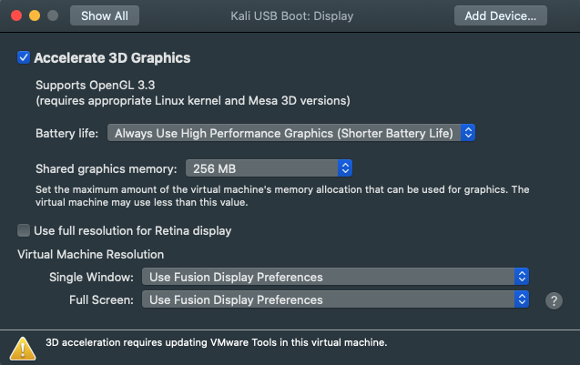

Now we can get into the USB section and ensure everything will work like a real system. In "USB Devices" ensure that "USB Compatibility" is set to "USB 3.0" if you have a compatible setup. If you are using USB-C, ensure that you have USB 3.0 selected. The "Plug In Action" should be set to "Connect to Linux".

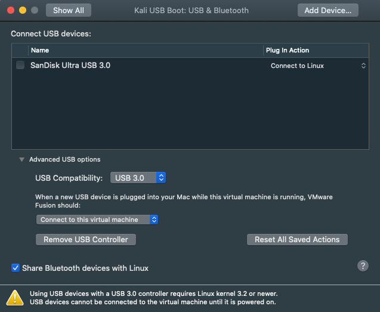

To remove the hard disk, go to "Disks" and then expand the "Advanced options" and click "Remove Hard Disk". You can send it to the trash.

Now we can power on the VM, and it should boot to Kali.

### Troubleshooting USB Connections

If you run into problems, you have a few options. First, power off your VM. Go to "Settings" -> "USB Devices" and leave this settings screen up next to your powered-off VM. (You can also expand your toolbar and look at the USB icon). Now, power on the VM. Immediately, you should see the USB Settings screen update with a check next to your USB device:

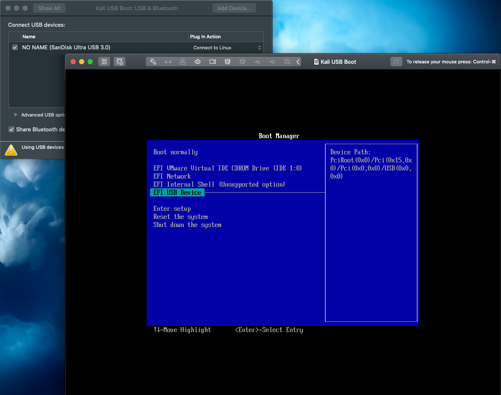

If you don't get a check mark, this means that your Mac has grabbed the USB drive. Power off your VM, eject the drive from the Mac, and power on the VM again with the USB settings screen up. You should see the check mark and get the Kali boot screen.

### Troubleshooting EFI

When booting with EFI, your boot screen should look like this:

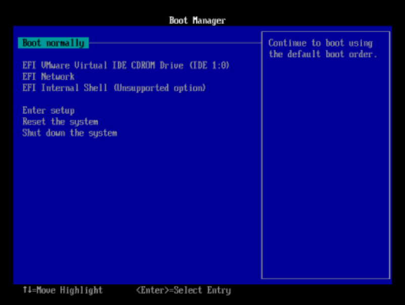

This indicates that EFI is enabled. If it's not, triple-check that you entered the firmware line correctly in the "Advanced" section of settings. Note that in some cases, this EFI Network check may hang. Simply pressing ESC within the VM nudges the process along.

To access the Boot Manager, you can click on "Virtual Machine" on the Apple window bar at the top, and then click "Power on to firmware".

From here, you can select "EFI Internal Shell" to get into the shell. If you get something like this, missing an fs0 map, then EFI doesn't see your USB drive. If this is the case, power off the virtual machine, unplug the USB, start the VM, and immediately after pressing start, insert the drive, looking for the checkmark in settings.

If everything goes well, you're booted into Kali Linux. Otherwise, you can get to an EFI shell with ESC, "EFI Internal Shell". A "happy" EFI shell looks like this:

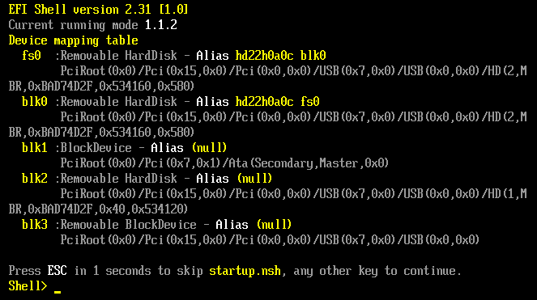

Note the fs0 map. Next, you can enter ‘fs0:' and ‘ls' to look around.

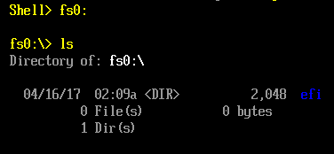

You can enter ‘cd efi\boot' (notice the backslash, not a forward slash!) and boot the device manually with ‘bootx64.efi'

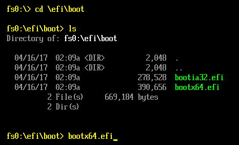

This should give you a happy EFI boot:

Note that on some installations, the shutdown, followed by removing the drive, powering on the VM and inserting the drive might be required. This likely has much to do with the Mac grabbing the USB drive, or half-grabbing it (without mounting).

### Final option

If neither of the above worked to fix you booting directly into Kali, but you _can_ boot as seen by troubleshooting EFI, you can always use the boot manager to boot into Kali Linux. Access the Boot Manager by clicking on "Virtual Machine" on the Apple window bar at the top, and then click "Power on to firmware". Select the option "EFI USB Device" and hit enter.

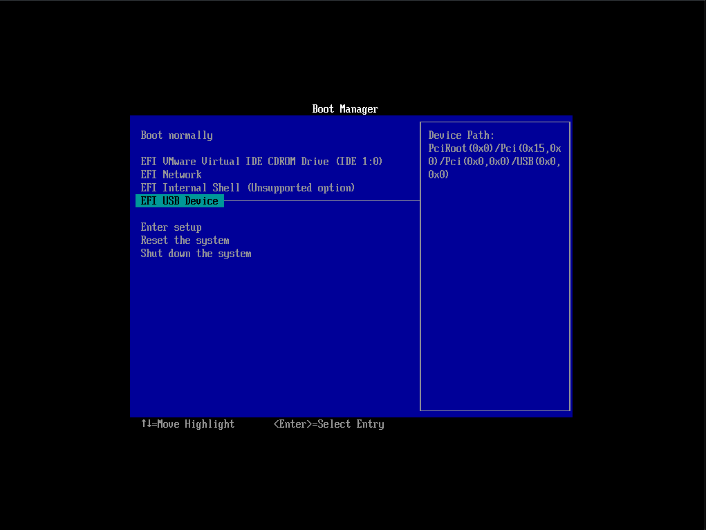

This should give you a happy EFI boot:

