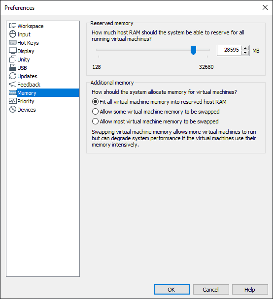

# Setting Memory Limits for your Virtual Machines

When you are running a virtual machine on your host operating system, they tend to not behave well when they run low on free memory for their own use. In certain situations, a Windows or Linux host operating system may not have enough memory for even its own use. This will cause the virtual machine to thrash as it constantly swaps parts of the system memory between the hosts pagefile that is on disk.

With VMware you can set a limit on the number of virtual machines that can run at once based on the amount of memory by applying the changes in the application settings. This will prevent the virtual machines from causing them to perform poorly while using your host operating system. 

To change this setting, select Edit > Preferences (CTRL+P) and select Memory. 

Lets take a look at the settings we currently have. As you can see we have 28GB reserved on the host system that can be used to run our virtual machines.

In the "Additional memory" section you will see three options:

- Fit all virtual machine memory into reserved host RAM — Strictly apply the reserved memory limit set. This setting enables a variety of tight restrictions based on the number and memory size of virtual machines that may run at a given time. Since the virtual machines are running entirely in RAM, they have the best possible performance.
- Allow some virtual machine memory to be swapped — This will allow the host operating system to swap a certain amount of virtual machine memory to disk if necessary. Using this setting can increase the number or memory size of virtual machines that can run on the host system at a given time. However, It may also result in reduced performance if virtual machine memory must be transferred between the virtual machine memory and host storage.
- Allow most virtual machine memory to be swapped — Allows the host operating system to swap as much virtual machine memory to disk as desired. By enabling this setting it will allow you to run more virtual machines with more memory than the intermediate setting does. However, performance may be lower if virtual machine memory must be shifted between RAM and disk.

Between all three options selecting "Fit all virtual machine memory into reserved host RAM" will apply a reserved memory limit to have the best possible performance. 

# References
- https://communities.vmware.com/t5/VMware-Workstation-Pro/New-Install-VMWare-Workstation-16-extremely-slow-locking-up/td-p/2878643
- https://stuff.mit.edu/afs/sipb/project/vmdialup/lib/vmware-console/help/server/memory.htm#:~:text=To%20change%20this%20setting%2C%20choose,the%20top%20of%20the%20panel.