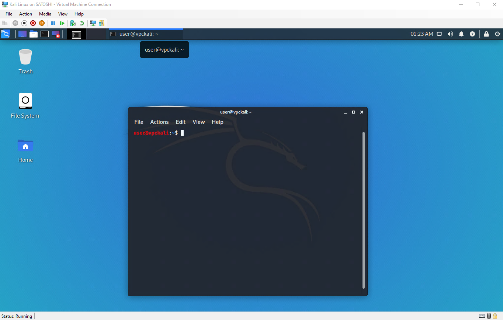
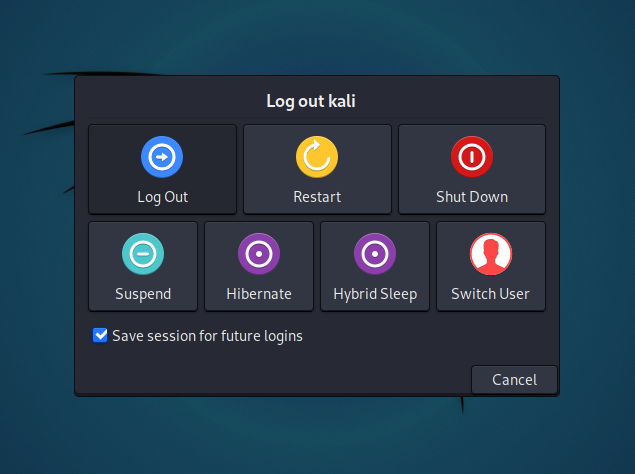
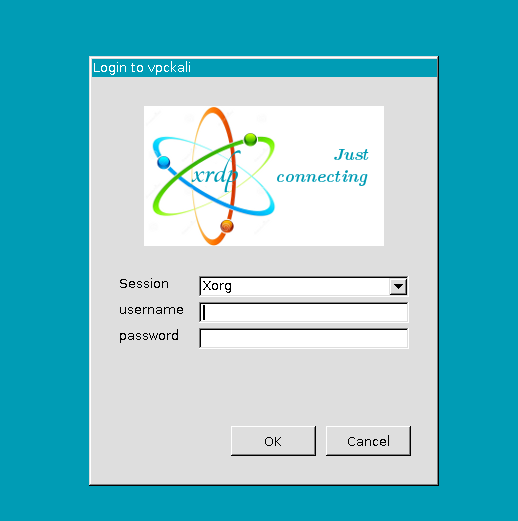

Installing "Guest VM Packages", gives a better user experience with VMs in general. This is why since Kali Linux 2019.3, during the [setup process](https://gitlab.com/kalilinux/build-scripts/live-build-config/-/blob/master/simple-cdd/profiles/offline.downloads) it should **detect if Kali Linux is inside a VM**. If it is, then **automatically install any additional tools** (in Hyper-V's case, `hyperv-daemons`). The Kali Linux Live image also comes with hyperv-daemons pre-installed since Kali Linux 2021.3.

However this is not the end of the story, and more can be done to improve the experience afterwards. This is because Hyper-V can connect to Virtual Machines using **Remote Desktop Protocol** (RDP).

This article will help you to enable the **[Enhanced Session Mode](https://techcommunity.microsoft.com/t5/virtualization/sneak-peek-taking-a-spin-with-enhanced-linux-vms/ba-p/382415)**, which improves latency and opens up the possibility of clipboard sharing and windows resizing.




## Configurating Kali

To configure Kali for Hyper-V Enhanced Session Mode, run `kali-tweaks`:

```console
kali@kali:~$ kali-tweaks
```

In the menu, select *Virtualization*, then *Configure the system for Hyper-V enhanced session mode*. And that's all there is to do on Kali's side.


## Changing the Setting of the Virtual Machine

You now need to change the **transport type** from VMBus to **HVSocket**.

First, log out of the current Kali's session:



On the Windows host now: disconnect the Kali VM, open a PowerShell (with Administrator privileges) and issue the following command:

```console
> Set-VM "(YOUR VM NAME HERE)" -EnhancedSessionTransportType HVSocket
```


## Test and Troubleshooting

We can test to see if it's been a success by starting the virtual machine again, and check if you can see the following screen when trying to use xrdp.



If this test doesn't succeed, you might need to reboot, either the Kali VM, either the Windows host. Do what's the most convenient for you, but if ever you're using the Kali Live image, keep in mind that rebooting means loosing all your changes: you'll have to redo the configuration step on Kali's side.


## Disabling Hyper-V Enhanced Session Mode

If ever you find out that this mode was not what you wanted, it's possible to undo the configuration on Kali's side. Not difficult but you need to do the steps in the right order, so let's detail it here.

First, log out of the current Kali's session. Then on the Windows host, disconnect the Kali VM. Then reconnect without Enhanced Session Mode, and log in Kali. Finally, open a terminal and just use `kali-tweaks` again:

```console
kali@kali:~$ kali-tweaks
```

In the *Virtualization* menu, you will find a setting to disabled Hyper-V Enhanced Session Mode.


## Further notes

More details and troubleshooting can be found in the following [conversation on GitLab](https://gitlab.com/kalilinux/build-scripts/live-build-config/-/issues/32#note_650129582).

This feature was made possible thanks to the work of [Satoshi Mimura](https://github.com/mimura1133/linux-vm-tools) who ported the scripts (initially for Ubuntu) to Kali Linux, and Shane Bennett who helped to rework it for `kali-tweaks`, and provided most of the material for this documentation. Thanks!
