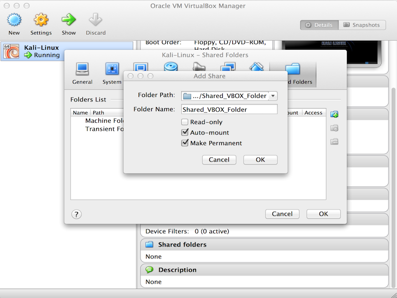
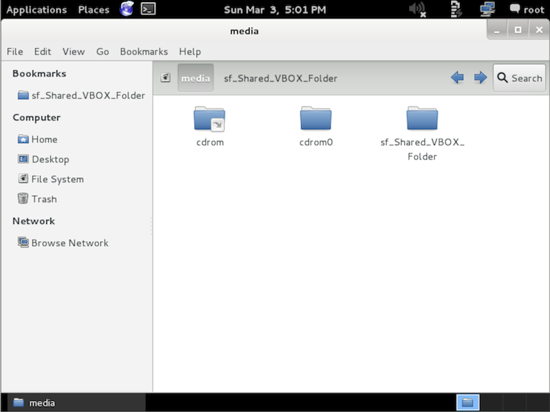

**This page is dated**. You can find the **latest version** here: [https://www.kali.org/docs/virtualization/install-virtualbox-guest-additions/](/docs/virtualization/install-virtualbox-guest-additions/).

- - -

If you run Kali Linux as a "guest" within VirtualBox, this article will help you to successfully install the "Guest Addition" tools.

You must use **VirtualBox 4.2.xx or higher** in order to take advantage of the improvements, including compatibility updates, and enhanced stability of both the core application and the Guest Additions.

## Preparing

Start up your Kali Linux virtual machine, open a terminal window and issue the following command to install the Linux kernel headers.

```console
kali@kali:~$ sudo apt update
...
kali@kali:~$
kali@kali:~$ sudo apt install -y linux-headers-$( uname -r )
...
kali@kali:~$
```

- - -

Once this is complete you can now attach the **Guest Additions** CD-ROM image. This can be done by selecting **Devices** from the VirtualBox menu and then select **Install Guest Additions**.

This will mount the Guest Additions ISO in the virtual CD drive in your Kali Linux virtual machine. When prompted to autorun the CD, click the **Cancel** button.


## Installing

From a terminal window, copy the `VboxLinuxAdditions.run` file from the Guest Additions CD-ROM to a path on your local system. Ensure it is **executable and run** the file to begin the installation.

```console
kali@kali:~$ cp /media/cdrom/VBoxLinuxAdditions.run ~/Downloads/
kali@kali:~$ chmod 0755 ~/Downloads/VBoxLinuxAdditions.run
kali@kali:~$ cd ~/Downloads/
kali@kali:~/Downloads$ ./VBoxLinuxAdditions.run
```

Reboot the Kali Linux VM to complete the Guest Additions installation. You should now have full mouse and screen integration as well as the ability to share folders with the host system.

## Creating Shared Folders with the Host System

This section explains how to share folders on your host system with your Kali Linux VirtualBox "guest".

From the VirtualBox Manager, select your Kali Linux VM instance and click on the **Shared Folders** link in the right window pane. This will launch a pop up window for adding shared folders. Within this window click the **Add Folders** icon.

In the Folder Path text box, provide the path to the folder you would like to share, or click the drop-down arrow to browse your host system for the path to the folder. Select the check boxes that allow for **Auto-mount** and **Make Permanent** and click the **OK** button both times when prompted.



Your shared folders will now be available in the media directory. You can create a bookmark or link for easier access to the directory.


