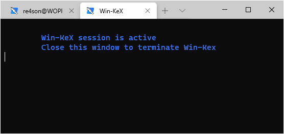
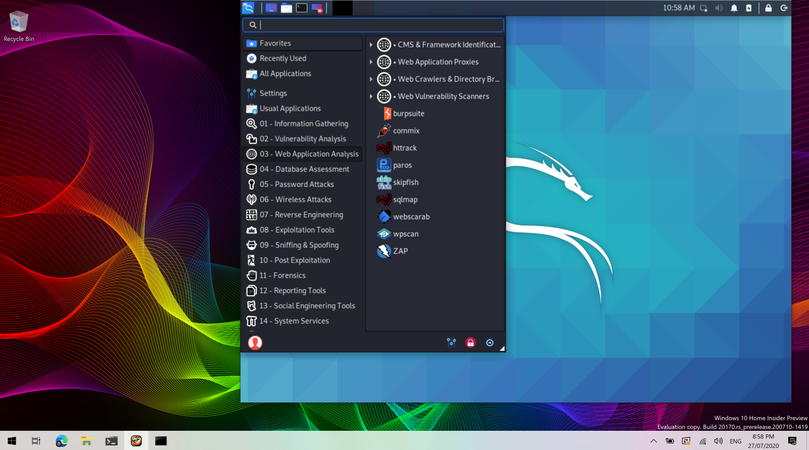
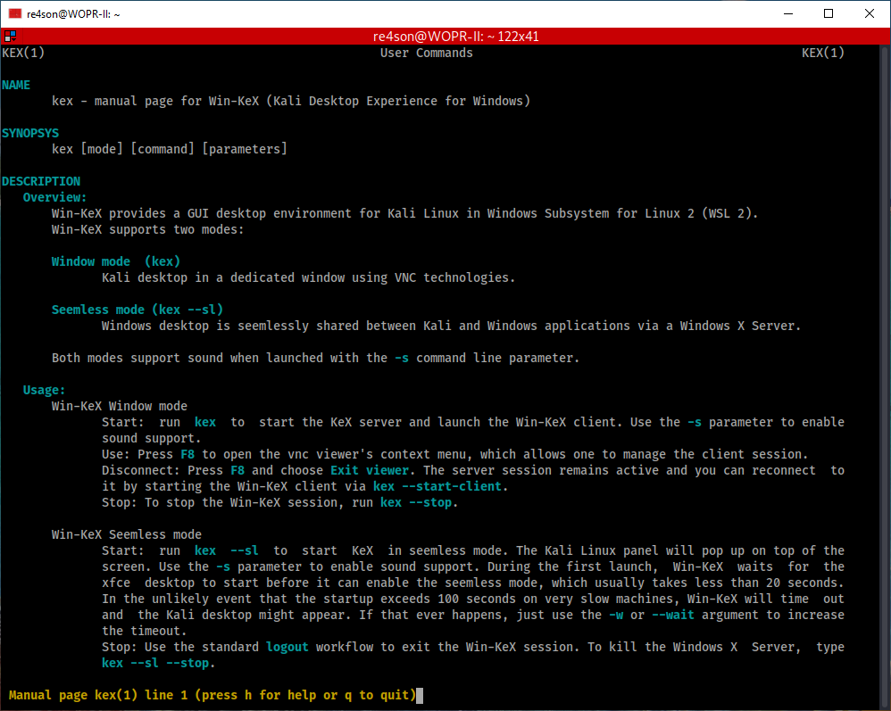

## Content:

- [Overview](#overview)
- [Installation](#installation)
  - [Prerequisites](#prerequisites)
  - [Install Kali Linux in WSL2](#install-kali-linux-in-wsl2)
  - [Install Win-Kex](#install-win-kex)
- [Run Win-KeX](#run-win-kex)
- [Optional steps](#optional-steps)


## Overview

#### Win-KeX provides a Kali Desktop Experience for Windows Subsystem for Linux (WSL 2) with the following features:

- Window mode: start a Kali Linux desktop in a dedicated window
- Seamless mode: share the Windows desktop between Windows and Kali apps and menus
- Sound support
- Unprivileged and Root session support
- Shared clipboard for cut and paste support between Kali Linux and Windows apps
- Multi-session support: root window & non-priv window & seamless sessions concurrently


#### This page details the steps to install Win-Kex in under 2 minutes.


## Installation

All installation steps, up to the point where we install Win-Kex, are also explained in the 5 minute video guide by the amazing [NetworkChuck](https:/twitter.com/NetWorkChuck):

[Kali Linux on Windows in 5min (WSL2 GUI)](https://www.youtube.com/watch?v=AfVH54edAHU)

Note: You can skip the installation of xrdp and follow [the last step of this guide](#install-win-kex) to install Win-Kex instead.


### Prerequisites

- Running Windows 10 version 2004 or higher
- Using [Windows Terminal](https://www.microsoft.com/en-us/p/windows-terminal/9n0dx20hk701)

### Install Kali Linux in WSL2

- Open PowerShell as administrator and run:

  ```
  Enable-WindowsOptionalFeature -Online -FeatureName Microsoft-Windows-Subsystem-Linux
  ```

- Restart

- Open PowerShell as administrator and run:

  ```
  dism.exe /online /enable-feature /featurename:VirtualMachinePlatform /all /norestart
  dism.exe /online /enable-feature /featurename:Microsoft-Windows-Subsystem-Linux /all /norestart
  ```

- Restart

- Download and install the WSL2 Linux Kernel from here: https://aka.ms/wsl2kernel

- Open PowerShell as administrator and run:
`wsl --set-default-version 2`

- Install Kali Linux from the Microsoft Store

  Note: to upgrade an existing WSL1 kali-linux installation, type:
  `wsl --set-version kali-linux 2`

- Run Kali and finish the initial setup


### Install Win-KeX

- Install win-kex via:
  `sudo apt update && sudo apt install kali-win-kex`


## Run Win-KeX

#### Win-KeX supports two modes:

  - Window Mode:
    

    To start Win-KeX in Window mode with sound support, run

    `win-kex --win -s`

    Refer to the [Win-KeX Win usage documentation](../win-kex-win/) for further information.


  - Seamless mode:

    

    To start Win-KeX in Seamless mode with sound support, run

    `win-kex --sl -s`

    Refer to the [Win-KeX SL usage documentation](../win-kex-sl/) for further information.

## Optional Steps:

- If you have the space, why not install "Kali with the lot"?:
`sudo apt install kali-linux-large`

  


- Create a [Windows Terminal](https://www.microsoft.com/en-us/p/windows-terminal/9n0dx20hk701) Shortcut:

  


 Choose amongst these options:

  **Basic Win-KeX in window mode with sound:**

  ```
  {
        "guid": "{55ca431a-3a87-5fb3-83cd-11ececc031d2}",
        "hidden": false,
        "name": "Win-KeX",
        "commandline": "wsl -d kali-linux kex --wtstart -s",
  },
  ```


  **Advanced Win-KeX in window mode with sound - Kali icon and start in kali home directory:**

  Copy the kali-menu.png icon across to your windows picture directory and add the icon and start directory to your WT config:

  ```
  {
          "guid": "{55ca431a-3a87-5fb3-83cd-11ececc031d2}",
          "hidden": false,
  		"icon": "file:///c:/users/<windows user>/pictures/icons/kali-menu.png",
          "name": "Win-KeX",
          "commandline": "wsl -d kali-linux kex --wtstart -s",
  		"startingDirectory" : "//wsl$/kali-linux/home/<kali user>"
  },
  ```

 **Basic Win-KeX in seamless mode with sound:**

  ```
  {
        "guid": "{55ca431a-3a87-5fb3-83cd-11ececc031d2}",
        "hidden": false,
        "name": "Win-KeX",
        "commandline": "wsl -d kali-linux kex --sl --wtstart -s",
  },
  ```


  **Advanced Win-KeX in seamless mode with sound - Kali icon and start in kali home directory:**

  Copy the kali-menu.png icon across to your windows picture directory and add the icon and start directory to your WT config:

  ```
  {
          "guid": "{55ca431a-3a87-5fb3-83cd-11ececc031d2}",
          "hidden": false,
  		"icon": "file:///c:/users/<windows user>/pictures/icons/kali-menu.png",
          "name": "Win-KeX",
          "commandline": "wsl -d kali-linux kex --sl --wtstart -s",
  		"startingDirectory" : "//wsl$/kali-linux/home/<kali user>"
  },
  ```

  

  

  


### Help

For more information, ask for help via:

`kex --help`

or consult the manpage via:

`man kex`    


or join us in the [Kali Forums](https://forums.kali.org/)


#### Enjoy Win-KeX!
